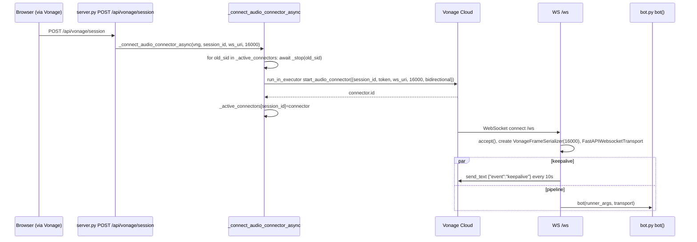

# Design Document: audio-connector-bridge

## Overview

**Purpose:** Relay Vonage Video microphone audio to the server Pipecat pipeline and optionally return synthesized audio. The bridge connects Vonage Audio Connector (`AudioConnectorWebSocket`) to Pipecat frames via `VonageFrameSerializer` at `server.py:234` and `FastAPIWebsocketTransport` at `240`, with 10-second keepalive at `250` and lifecycle management via `_active_connectors` at `68`.

**Users:** Vonage Video Cloud (Audio Connector WebSocket client) and downstream `voice-pipeline-core` pipeline (`bot.py`).

**Impact:** Expands `server.py` with WebSocket `/ws` and connector helpers. Assumes `session-provisioning` has already created a session and derived `WS_URI`.

### Goals
- Ensure exactly one Audio Connector per system (global singleton) with clean stop/start
- Expose `/ws` that accepts Vonage WebSocket, creates serializer and transport, and delegates to `voice-pipeline-core` `bot()`
- Maintain 10s keepalive to satisfy Vonage 30s timeout
- Avoid blocking FastAPI event loop via `run_in_executor`

### Non-Goals
- Session/token issuance (→ `session-provisioning`)
- STT/LLM/TTS logic (→ `voice-pipeline-core`)
- Text fan-out or avatar rendering (→ `text-bridge-avatar`)
- Frontend OT publish/subscribe (→ `vonage-media-frontend`)

## Boundary Commitments

### This Spec Owns
- `_active_connectors: dict[str, object]` at `68` and functions `_connect_audio_connector_async` at `71`, `_stop_audio_connector_async` at `99`
- `WS /ws` handler at `227` including `VonageFrameSerializer`, `FastAPIWebsocketTransport`, 10s keepalive task, and `bot()` delegation
- `bidirectional=True` decision and 16000 Hz alignment

### Out of Boundary
- `POST /api/vonage/session` response shape (owned by `session-provisioning`); this spec only consumes `session_id`/`ws_uri`
- Pipeline stages (`stt`, `llm`, etc.) and `LLMTextForwarder` (owned by `voice-pipeline-core`)
- Tunnel URL derivation (owned by `session-provisioning`)

### Allowed Dependencies
- `vonage-video` (`AudioConnectorWebSocket`, `AudioConnectorOptions`) and `pipecat-ai` (`VonageFrameSerializer`, `FastAPIWebsocketTransport`, `WebSocketRunnerArguments`)
- `session-provisioning` for `session_id`/`ws_uri` (read-only); `voice-pipeline-core` for `bot()` (call-only)
- `loguru` for logging; no DB

### Revalidation Triggers
- `WS /ws` path change — breaks Vonage `AudioConnectorWebSocket.uri` and tunnel `WS_URI`
- `VonageFrameSerializer` input param rename (`vonage_sample_rate`) — breaks serializer
- `_active_connectors` semantics change from global singleton to per-session — breaks concurrent user assumption
- Keepalive interval or payload `{"event":"keepalive"}` change — breaks Vonage timeout

## Architecture

### Existing Architecture Analysis
*Pattern:* FastAPI WebSocket endpoint acting as Vonage Audio Connector terminator. Existing code uses raw `dict` without lock and raw `_http_client.delete` bypassing SDK.
*Constraints:* Vonage Audio Connector requires bidirectional WebSocket with keepalive within 30s; serializer must match `VONAGE_AUDIO_RATE` (16000).

### Architecture Pattern & Boundary Map

```mermaid
graph TB
  subgraph Server server.py
    Conn[_connect_audio_connector_async<br/>71]
    Stop[_stop_audio_connector_async<br/>99]
    Dict[_active_connectors dict<br/>68]
    WS[WS /ws<br/>227]
    Ser[VonageFrameSerializer<br/>234]
    Trans[FastAPIWebsocketTransport<br/>240]
    Keep[keepalive 10s<br/>250]
  end
  subgraph Vonage Cloud
    AC[Audio Connector]
  end
  subgraph Pipeline
    Bot[voice-pipeline-core bot()<br/>bot.py:196]
  end
  AC -->|WebSocket| WS
  WS --> Ser --> Trans --> Bot
  Conn -->|start_audio_connector via run_in_executor| AC
  Conn <--> Dict
  Stop <--> Dict
  Keep -->|send_text keepalive| WS
```

**Architecture Integration:**
- Pattern: Anti-Corruption Layer (serializer) between Vonage binary frames and Pipecat `AudioRawFrame`.
- Boundaries: This spec owns transport/serializer; pipeline owns STT/LLM; session spec owns token.
- Preserved: `run_in_executor` offload, `bidirectional=True`, `audio_out_10ms_chunks=2` (20ms).
- Steering: `tech.md` System Components Map (Audio WS Bridge) preserved; `tech.md` Key Decision (Vonage I/O via thread pool) enforced.

### Technology Stack

| Layer | Choice / Version | Role in Feature | Notes |
|-------|------------------|-----------------|-------|
| Backend / Services | FastAPI `WebSocket`, `WebSocketRunnerArguments` | Terminate Vonage WS | `await websocket.accept()` |
| Backend / Services | `vonage-video` `AudioConnectorWebSocket`, `AudioConnectorOptions` | Build connector opts | `bidirectional=True` |
| Data / Storage | In-memory `dict` `_active_connectors` | Track single connector | Global singleton |
| Messaging / Events | `VonageFrameSerializer`, `FastAPIWebsocketTransport` | Frame conversion, transport | `vonage_sample_rate=16000` |
| Infrastructure / Runtime | `asyncio.create_task` keepalive | Prevent Vonage timeout | 10s interval |

## File Structure Plan

### Directory Structure
```
server.py               # Modified: connectors dict 68, _connect 71, _stop 99, /ws 227
bot.py                  # No change; imported via from bot import bot
```

### Modified Files
- `server.py` — Add `_active_connectors` (68), `_connect_audio_connector_async` (71), `_stop_audio_connector_async` (99), `@app.websocket("/ws")` (227) with serializer (234), transport (240), keepalive (250), and `bot()` delegation (262). Each helper has one responsibility; `/ws` is the single WebSocket entry.

## System Flows



*Decisions:* `run_in_executor` for `start_audio_connector` avoids blocking; `for old_sid in list(dict.keys())` snapshots keys to avoid mutation during iteration; keepalive `break` on exception stops task.

## Requirements Traceability

| Requirement | Summary | Components | Interfaces | Flows |
|-------------|---------|------------|------------|-------|
| 1.1-1.6 | Connector lifecycle | `ConnectorLifecycle` | `_connect/_stop`, `DELETE /v2/.../connect` | Connector flow |
| 2.1-2.6 | /ws endpoint | `WsEndpoint` | `WS /ws`, `VonageFrameSerializer`, `FastAPIWebsocketTransport` | WS flow |
| 3.1-3.4 | Rate/serialization | `WsEndpoint` | `vonage_sample_rate` | — |
| 4.1-4.3 | Concurrency/resource | `ConnectorLifecycle`, `WsEndpoint` | `_active_connectors` | — |
| 5.1-5.6 | Non-functional | `ConnectorLifecycle`, `WsEndpoint` | — | — |

## Components and Interfaces

| Component | Domain/Layer | Intent | Req Coverage | Key Dependencies (P0/P1) | Contracts |
|-----------|--------------|--------|--------------|--------------------------|-----------|
| `ConnectorLifecycle` | Backend | Manage single Audio Connector via global dict | 1, 4, 5 | `session-provisioning` (P0), Vonage SDK (P0) | Service |
| `WsEndpoint` | Backend | Terminate Vonage WS, serialize frames, keepalive, delegate to pipeline | 2, 3, 4, 5 | `ConnectorLifecycle` (P1), `voice-pipeline-core` (P0) | API, Event |

### Backend

#### ConnectorLifecycle

| Field | Detail |
|-------|--------|
| Intent | Ensure one connector at a time and clean stop via raw HTTP delete |
| Requirements | 1.1, 1.2, 1.3, 1.4, 1.5, 1.6, 4.1, 4.3, 5.1, 5.2, 5.6 |
| Owner / Reviewers | — |

**Responsibilities & Constraints**
- Iterates `list(_active_connectors.keys())` and awaits `_stop` for each old `session_id` (global singleton).
- Builds `TokenOptions(publisher)` and `AudioConnectorOptions(bidirectional=True)` then `run_in_executor` `start_audio_connector`.
- `_stop` pops dict, then `run_in_executor` `vng._http_client.delete(video_host, "/v2/project/{appId}/connect?sessionId={id}")` — raw path (flagged for SDK migration).
- Invariant: No lock; concurrent POSTs may race (documented).

**Dependencies**
- Inbound: `VonageSessionHandler` POST (P0)
- Outbound: Vonage `start_audio_connector` / raw `DELETE` (P0)
- Outbound: `loguru` (P1)

**Contracts**: Service [x] / API [ ] / Event [ ] / Batch [ ] / State [x]

##### Service Interface
```python
_active_connectors: dict[str, object]  # module global at 68
async def _connect_audio_connector_async(vng: Vonage, session_id: str, ws_uri: str, audio_rate: int) -> None
async def _stop_audio_connector_async(session_id: str) -> None
```
- Preconditions: `vng` authenticated; `ws_uri` `ws`/`wss` validated upstream; `audio_rate` int.
- Postconditions: `_active_connectors` holds exactly one entry after `_connect`; zero after `_stop` of that id.
- Invariants: `bidirectional=True` always; `audio_rate` 16000 canonical.

**Implementation Notes**
- Validation: Call `_connect` twice with different `session_id` → first stopped, second stored; verify `DELETE` path includes `application_id`.
- Risks: Raw `DELETE` path hardcode; future SDK `stop_audio_connector` should replace.

#### WsEndpoint

| Field | Detail |
|-------|--------|
| Intent | Accept Vonage WS, create serializer/transport, keepalive, run pipeline |
| Requirements | 2.1, 2.2, 2.3, 2.4, 2.5, 2.6, 3.1-3.4, 4.2, 5.2, 5.4 |
| Owner / Reviewers | — |

**Responsibilities & Constraints**
- `await websocket.accept()` then `VonageFrameSerializer(InputParams(vonage_sample_rate=sample_rate))` where `sample_rate = int(os.getenv("VONAGE_AUDIO_RATE","16000"))`.
- `FastAPIWebsocketTransport(..., audio_in_enabled=True, audio_out_enabled=True, audio_out_10ms_chunks=2, serializer=serializer)` — `2` = 20ms chunks (implicit now explicit).
- Spawns `keepalive()` task `send_text('{"event":"keepalive"}')` every 10s; `break` on exception.
- Delegates to `bot(WebSocketRunnerArguments(websocket, body={}), transport)` then `keepalive_task.cancel()` and `transport.cleanup()` in `finally`.

**Dependencies**
- Inbound: Vonage Audio Connector WebSocket (P0)
- Outbound: `voice-pipeline-core.bot()` (P0)
- External: `VonageFrameSerializer` (P0)

**Contracts**: Service [ ] / API [x] / Event [x] / Batch [ ] / State [ ]

##### API Contract
| Method | Endpoint | Request | Response | Errors |
|--------|----------|---------|----------|--------|
| WS | `/ws` | Vonage binary audio frames (via Audio Connector) | Pipecat frames via serializer; `{"event":"keepalive"}` every 10s | 101 Switching Protocols; 500 if serializer fails |

##### Event Contract
- Published events: `keepalive` text every 10s (required by Vonage; missing >30s closes connector)
- Subscribed events: Vonage binary audio frames
- Ordering: Keepalive independent of audio; audio frames via serializer preserve order.

##### State Management
- State model: WebSocket `OPEN` vs closed; `_active_connectors` elsewhere.
- Persistence: In-memory; no DB.
- Concurrency: One `bot()` task per `/ws` connection; `worker.cancel` on disconnect.

**Implementation Notes**
- Validation: Connect dummy Vonage WS → serializer produces `AudioRawFrame` at 16000; verify keepalive every 10s via `pytest` mock `websocket.send_text` call count.
- Risks: Missing `asyncio.Lock` for `_active_connectors`; no `lifespan` cleanup on shutdown (gap flagged).

## Data Models

### Domain Model
No persisted domain; `Audio Connector` is external Vonage resource `connector.id` (opaque). `VonageFrame` is transient.

### Logical Data Model
**Structure Definition:**
- `AudioConnectorOptions{session_id, token, websocket{uri, audio_rate, bidirectional}}` → Vonage `start_audio_connector`.
- `VonageFrameSerializer.InputParams{vonage_sample_rate: int}` → serializer.

**Consistency & Integrity:**
- `audio_rate` in `AudioConnectorWebSocket` must equal `VonageFrameSerializer` `vonage_sample_rate` (both 16000) — mismatch causes resampling distortion.

### Data Contracts & Integration

**API Data Transfer**
- `WS /ws` request: Vonage binary audio (Opus/PCM encapsulated); response: `{"event":"keepalive"}` text and Pipecat-forwarded audio out.

**Event Schemas**
- Keepalive: `{"event":"keepalive"}` (static JSON) — backward compatible if extra fields added, but must remain text not binary.

## Error Handling

### Error Strategy
- `_connect` `start_audio_connector` throws → propagate to `POST /api/vonage/session` 500 (no dict insertion).
- `_stop` `DELETE` throws → log `Failed to stop Audio Connector` warning, swallow (idempotent).
- `bot()` throws → log `Pipecat bot error`, cancel keepalive, cleanup transport.

### Error Categories and Responses
**User Errors (4xx):** None (Vonage is caller).
**System Errors (5xx):** `500` if `int(VONAGE_AUDIO_RATE)` fails; `500` if `start_audio_connector` fails; keepalive `break` on `send_text` failure.
**Business Logic Errors (422):** None.

### Monitoring
- Logs: `Connecting Audio Connector: session={id}, ws={uri}` at INFO; `Audio Connector started: id={id}` at INFO; `Client connected to /ws` at INFO.
- Metrics: No metrics yet; future count `_active_connectors` size.

## Testing Strategy

- **Unit Tests:** `_connect` global singleton (second call stops first); `_stop` idempotent (no entry → no-op); `_stop` raw DELETE path format; serializer creation with `16000` vs `8000`.
- **Integration Tests:** Mock `vng.video.start_audio_connector` success/failure; `TestClient` WebSocket `/ws` with mock `bot` → verify `VonageFrameSerializer` instantiated and keepalive sent 3 times in 30s.
- **E2E/UI Tests:** Real Vonage session → `POST /api/vonage/session` → verify `/ws` accepts Audio Connector and pipeline logs `Client connected`.
- **Performance/Load:** Concurrent `/ws` connections not expected (1 per session); verify `_active_connectors` size stays 1.

## Security Considerations
- No `private_key`/`token` logging; only `session_id`/`connector.id`.
- `ws://` allowed only for localhost dev; prod must use `wss` (validated upstream).
- No auth on `/ws` — relies on Vonage connector token; no direct browser access.

## Performance & Scalability
- `run_in_executor` prevents blocking; 20ms chunks (`audio_out_10ms_chunks=2`) balance latency vs overhead.
- Single connector limits scale to one concurrent user — intentional demo, not horizontal scaling.

## Supporting References
- Vonage Audio Connector spec: keepalive within 30s → `research.md` if needed.
