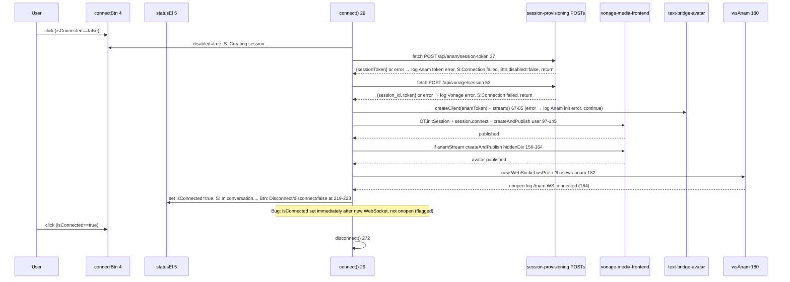
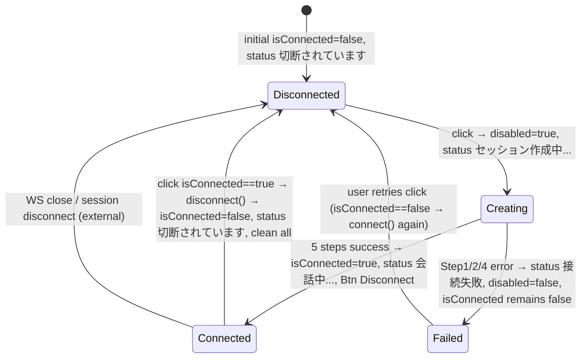

# Design Document: connection-lifecycle

## Overview

**Purpose:** Own the 5-step connection orchestration and disconnection lifecycle. Integrates `connect()` at `static/script.js:29` (①Anam token → ②Vonage session → ③Anam init → ④Vonage connect+dual publish → ⑤/ws-anam) and `disconnect()` at `272`, plus server `lifespan` at `server.py:126` and `CORSMiddleware` at `137`, providing a single "Connect" button experience where `isConnected` and `connectBtn`/`statusEl`/`logEl` are the source of truth (`static/script.js:4,18`).

**Users:** End-user clicking Connect/Disconnect; operator observing startup logs via `lifespan`.

**Impact:** Expands `static/script.js` state machine and `server.py` lifespan/CORS. Depends on `frontend-shell` DOM sinks and all media/bridge specs; final integration spec (Wave 6).

### Goals
- Execute 5 steps sequentially with fail-fast per step (Step 1/2 abort, Step 3 degrades to audio-only) and re-enable button on failure
- Maintain `isConnected` state and reflect `statusEl` among four Japanese literals (`切断されています`/`セッション作成中...`/`会話中...`/`接続失敗`)
- Release all resources on `disconnect()` (wsAnam, publishers, session, tracks, Anam client, talk stream) even if prior step throws
- Manage server `lifespan` logs and `CORSMiddleware` for demo open CORS (flagged invalid for prod)

### Non-Goals
- Layout/CSS (→ `frontend-shell`)
- Individual OT/Anam SDK call details beyond delegation (→ respective specs)
- STT/LLM or tunnel

## Boundary Commitments

### This Spec Owns
- `static/script.js:29` `connect()` 5-step sequence including `fetch` calls, `setStatus`/`log`, `connectBtn.disabled`, `isConnected` flag at `18,30,219,275`
- `static/script.js:272` `disconnect()` full cleanup at `277-304` including `wsAnam` ping interval (leak flagged), `session.unpublish`/`disconnect`, `anamStream` track stop, `anamClient.stopStreaming`, `currentTalkStream` reset, and status/button reset
- `server.py:126` `lifespan` (startup/shutdown logs) and `server.py:137` `CORSMiddleware` (allow all, flagged invalid with credentials)
- `static/script.js:311-316` `connectBtn` click listener and initial `log('Ready...')`

### Out of Boundary
- `OT.initPublisher` internals or `createClient.stream()` details (delegated to `vonage-media-frontend`/`text-bridge-avatar` but invoked here)
- `/ws` and `/ws-anam` handler bodies (owned by bridge specs but called here)
- `GET /health` (→ `ops-deployment`)

### Allowed Dependencies
- `frontend-shell` DOM (`connectBtn`, `statusEl`, `logEl`, `userVideoContainer`, etc.) — read/write `textContent`/`className`/`disabled`
- `session-provisioning` `POST /api/anam/session-token` and `POST /api/vonage/session` — HTTP fetch
- `vonage-media-frontend` OT session/publish/subscribe primitives
- `text-bridge-avatar` `anamStream`/`wsAnam`/`TalkMessageStream` and `server.py` `lifespan`/`CORS`

### Revalidation Triggers
- `connect()` step order change (e.g., moving Anam init before Vonage session) — breaks failure semantics (Step 1 abort vs Step 3 degrade)
- `isConnected` boolean to enum change — breaks `if (isConnected)` at `311` and `statusEl` four-value contract
- `lifespan` cleanup addition (stopping `_active_connectors` on shutdown) — changes shutdown behavior
- `CORSMiddleware` tightening from `*` to explicit origins — breaks demo `allow_credentials` flow

## Architecture

### Existing Architecture Analysis
*Pattern:* Single boolean state machine (`isConnected`) with imperative 5-step `connect()` and exhaustive `disconnect()` try/catch chain. Existing code sets `isConnected=true` optimistically after `new WebSocket` without waiting for `onopen`, and leaks `setInterval` at `210`.
*Constraints:* `connect()` must disable button to prevent re-entry; `disconnect()` must swallow per-resource exceptions to ensure all resources attempted.

### Architecture Pattern & Boundary Map

```mermaid
graph TB
  subgraph Browser static/script.js
    Btn[connectBtn<br/>4,311]
    Status[statusEl 5]
    Log[logEl 4]
    State[isConnected<br/>18]
    Conn[connect() 29<br/>5 steps]
    Disc[disconnect() 272<br/>cleanup]
    Ping[setInterval ping 210<br/>leak]
  end
  subgraph Server server.py
    Life[lifespan 126<br/>startup/shutdown log]
    CORS[CORSMiddleware 137<br/>allow *]
    Warn[filterwarnings 27]
  end
  Conn --> Btn
  Conn --> Status
  Conn --> Log
  Conn --> State
  Conn -->|calls| SessionProv[session-provisioning POSTs]
  Conn -->|calls| VMedia[vonage-media-frontend<br/>OT]
  Conn -->|calls| Anam[text-bridge-avatar<br/>Anam+wsAnam]
  Disc --> Btn & Status & Log & State
  Disc --> Ping
  Life -.->|logs| ServerLog
  CORS -.->|allow| Browser
```

**Architecture Integration:**
- Pattern: Imperative Orchestrator with state flag and exhaustive cleanup (try/catch per resource).
- Boundaries: This spec owns orchestration and state; media specs own primitives; shell owns DOM structure.
- Preserved: 5-step order, `disabled=true` at `30`, `isConnected=false` immediate at `275` on disconnect, `try/catch` per unpublish, `lifespan` logs, `allow_origins=["*"]` demo.
- Steering: `tech.md` System Components Map (Browser Connection Orchestrator, Infra Lifespan) preserved.

### Technology Stack

| Layer | Choice / Version | Role in Feature | Notes |
|-------|------------------|-----------------|-------|
| Frontend / CLI | JavaScript `fetch`, `WebSocket`, `OT` global | Orchestrate 5 steps | `location.protocol`→`wsProto` |
| Backend / Services | FastAPI `lifespan`, `CORSMiddleware`, `warnings` | Lifecycle and CORS | `loguru` |
| Data / Storage | In-memory `isConnected` boolean | State | `let isConnected=false` |
| Messaging / Events | `log` via `textContent` | Observability | `logEl` append |

## File Structure Plan

### Directory Structure
```
static/
├── index.html          # Provides DOM (frontend-shell)
└── script.js           # Modified: connect 29, disconnect 272, state 4/18, listener 311-316
server.py               # Modified: lifespan 126, CORS 137, filterwarnings 27
```

### Modified Files
- `static/script.js` — Add `isConnected` flag (18), `connect()` (29) with 5 steps (`fetch` Anam token 37, Vonage session 53, `createClient`/`stream` 67-90, OT session/connect/publish 97-169, `new WebSocket /ws-anam` 180-214), `disconnect()` (272) with exhaustive cleanup (277-304), `connectBtn` listener (311) and initial log (316). Single responsibility: orchestrate lifecycle.
- `server.py` — Add `lifespan` (126) `Server starting up...`/`shutting down...`, `CORSMiddleware` (137) allow all, `warnings.filterwarnings` (27) for `asyncio.iscoroutinefunction`.

## System Flows



*Decisions:* Step 3 failure degrades to audio-only (continue to Vonage) per `87` comment, but Step 1 failure aborts per `42` (inconsistent, flagged for degrade alignment). `WS_URI` derivation not owned here but via `session-provisioning`.



```mermaid
flowchart TD
  Disc[disconnect() 272] --> WSClose[if wsAnam close 277]
  WSClose --> Sess{session exists?}
  Sess -->|yes| UnpubA[unpublish anamPublisher 283]
  UnpubA --> UnpubU[unpublish userPublisher 284]
  UnpubU --> DiscSess[session.disconnect 285]
  DiscSess --> ClearSub[subscriber=null, session=null]
  Sess -->|no| ClearStream{anamStream exists?}
  ClearSub --> ClearStream
  ClearStream -->|yes| StopTracks[getTracks.stop 291]
  StopTracks --> ClearClient{anamClient exists?}
  ClearStream -->|no| ClearClient
  ClearClient -->|yes| StopStream[stopStreaming 295]
  StopStream --> Reset[currentTalkStream=null, status Disconnected, Btn Connect, log]
  ClearClient -->|no| Reset
```

## Requirements Traceability

| Requirement | Summary | Components | Interfaces | Flows |
|-------------|---------|------------|------------|-------|
| 1.1-1.6 | 5-step orchestration | `ConnectionOrchestrator` | `fetch` POSTs, `createClient`, `OT.initSession`, `WebSocket` | 5-step flow |
| 2.1-2.5 | Error/interrupt | `ConnectionOrchestrator` | `log`, `setStatus`, `disabled` | 5-step error branches |
| 3.1-3.7 | State/UI | `ConnectionState` | `isConnected`, `statusEl`, `connectBtn` | State diagram |
| 4.1-4.6 | Disconnect cleanup | `DisconnectionCleanup` | `wsAnam.close`, `session.unpublish/disconnect`, `tracks.stop` | Cleanup flowchart |
| 5.1-5.4 | Lifespan/CORS | `ServerLifecycle` | `lifespan`, `CORSMiddleware` | — |
| 6.1-6.4 | Keepalive | `KeepaliveCoordination` | keepalive `ping`/`{"event":"keepalive"}` | — |

## Components and Interfaces

| Component | Domain/Layer | Intent | Req Coverage | Key Dependencies (P0/P1) | Contracts |
|-----------|--------------|--------|--------------|--------------------------|-----------|
| `ConnectionOrchestrator` | Frontend | Execute 5 steps sequentially with per-step error handling | 1, 2 | `session-provisioning` (P0), `vonage-media-frontend` (P0), `text-bridge-avatar` (P0) | Service |
| `ConnectionState` | Frontend | Maintain `isConnected` and reflect `statusEl`/`connectBtn` | 3 | `ConnectionOrchestrator` (P0) | State |
| `DisconnectionCleanup` | Frontend | Exhaustively release all resources even if prior throws | 4 | `ConnectionOrchestrator` (P0) | Service |
| `ServerLifecycle` | Backend | Log startup/shutdown and configure CORS | 5 | None | Service |
| `KeepaliveCoordination` | Frontend/Backend | Document 10s vs 15s keepalive independence | 6 | `audio-connector-bridge` (P1), `text-bridge-avatar` (P1) | Event |

### Frontend

#### ConnectionOrchestrator

| Field | Detail |
|-------|--------|
| Intent | Single entry `connect()` that calls `session-provisioning`, `vonage-media-frontend`, `text-bridge-avatar` in order |
| Requirements | 1.1-1.6, 2.1-2.5, 3.1-3.2, 6.1 |
| Owner / Reviewers | — |

**Responsibilities & Constraints**
- Step 1: `fetch('/api/anam/session-token',{method:'POST'})` at `37`; if `!resp.ok` throw `Anam token error`, catch → `log`, `setStatus('接続失敗')` (`42-46`), `disabled=false`, `return` (aborts, flagged inconsistent with Step 3 degrade).
- Step 2: `fetch('/api/vonage/session')` at `53`; on error `Vonage error` at `58-61` → same abort.
- Step 3: `createClient(anamToken,{disableInputAudio:true})` at `67`, listeners at `71`, `await anamClient.stream()` at `80` → `anamVideo.srcObject` at `84` → `play()`; on error `Anam initialization error` at `88` continue (degrade) per `// Continue without Anam`.
- Step 4: `OT.initSession` at `97`, `session.on` at `99`, `session.connect` promisified at `122`, `createAndPublish` user at `145`, hidden avatar at `156-164` (delegates to `vonage-media-frontend` primitives but orchestrated here).
- Step 5: `new WebSocket(`${wsProto}//${host}/ws-anam`)` at `182`; `onopen/onmessage/onclose/onerror` at `184-207`; `setInterval ping` at `210` — sets `isConnected=true` at `219` immediately after construction (bug: should be `onopen`).

**Dependencies**
- Inbound: `connectBtn` click when `isConnected==false` (P0)
- Outbound: `session-provisioning` POSTs (P0), `vonage-media-frontend` OT calls (P0), `text-bridge-avatar` Anam+WS (P0)

**Contracts**: Service [x] / API [ ] / Event [ ] / Batch [ ] / State [ ]

##### Service Interface
```javascript
async function connect()  // 29, 5 steps, disables button at entry
function log(msg: string) // 20, appends [time] msg
function setStatus(s: string) // 27, textContent = s
```
- Preconditions: `isConnected==false`; DOM `connectBtn`/`statusEl`/`logEl` present.
- Postconditions: `isConnected==true` and status `会話中...` on success; `Connection failed` on Step 1/2/4 error.
- Invariants: `connectBtn.disabled=true` during `connect()` to prevent re-entry (Req 3.1).

**Implementation Notes**
- Validation: Mock `fetch` 401 for Step 1 → expect `Connection failed` and `disabled=false`; mock Step 3 throw → expect Vonage still attempted.
- Risks: Optimistic `isConnected` and leaked `setInterval` (Req 5.5-6, 4.1 flagged).

#### ConnectionState

| Field | Detail |
|-------|--------|
| Intent | Single source of truth `isConnected` with four `statusEl` literals |
| Requirements | 3.1-3.7, 5.4 |
| Owner / Reviewers | — |

**Responsibilities & Constraints**
- `let isConnected=false` at `18` (boolean, not enum — flagged insufficient for `Connecting` state).
- On `connect()` entry no `isConnected` change, only `disabled=true` (3.1); on success `isConnected=true` (3.2) at `219` (should be `onopen`); on `disconnect()` immediate `isConnected=false` at `275` (3.3).
- `if (isConnected) disconnect() else connect()` at `311` toggles; `statusEl` limited to `切断されています`/`セッション作成中...`/`会話中...`/`接続失敗` at `31,44,59,220,299`.

**Contracts**: Service [ ] / API [ ] / Event [ ] / Batch [ ] / State [x]

##### State Management
- State model: `isConnected: boolean`; `statusEl.textContent: string` Japanese literal.
- Persistence: In-memory per page load; resets on refresh.
- Concurrency: Single `connect()` at a time due to `disabled` guard; no lock for concurrent clicks before disabled.

#### DisconnectionCleanup

| Field | Detail |
|-------|--------|
| Intent | Release all resources exhaustively, swallowing per-resource exceptions |
| Requirements | 4.1-4.6, 6.2, 6.3 |
| Owner / Reviewers | — |

**Responsibilities & Constraints**
- Order: `wsAnam.close()`→`null` at `277-280` (missing `clearInterval` for ping — bug); `session.unpublish(anamPublisher)`→`unpublish(userPublisher)`→`session.disconnect()` at `283-285` each `try/catch` swallowed then `subscriber=null; session=null`; `anamStream.getTracks().forEach(t=>t.stop())` at `291`; `anamClient.stopStreaming()` at `295`; `currentTalkStream=null` at `299` then `setStatus('切断されています')`/`Connect`/`connect`/`log`.
- Each resource attempted even if prior `try` throws (exhaustive).

**Contracts**: Service [x] / API [ ] / Event [ ] / Batch [ ] / State [ ]

**Implementation Notes**
- Validation: Call `disconnect()` after full connect → verify `wsAnam==null`, `session==null`, `anamStream==null`, `anamClient==null`, `status` is `切断されています`.
- Risks: `setInterval` leak requires `clearInterval(intervalId)` stored from `210` (flagged).

### Backend

#### ServerLifecycle

| Field | Detail |
|-------|--------|
| Intent | Log startup/shutdown and configure demo CORS and warning suppression |
| Requirements | 5.1, 5.2, 5.3, 5.4, 4.1 (shutdown leak) |
| Owner / Reviewers | — |

**Responsibilities & Constraints**
- `@asynccontextmanager lifespan(app)` at `126`: `logger.info("Server starting up...")` on `yield` and `logger.info("Server shutting down...")` — does not clean `_active_connectors` on shutdown (gap).
- `CORSMiddleware(allow_origins=["*"], allow_credentials=True, allow_methods=["*"], allow_headers=["*"])` at `137` — invalid per CORS spec (flagged for prod tightened to explicit origins or `allow_credentials=False`).
- `warnings.filterwarnings("ignore", "'asyncio.iscoroutinefunction' is deprecated")` at `27` — hides pipecat warning.

**Contracts**: Service [x] / API [ ] / Event [ ] / Batch [ ] / State [ ]

## Data Models

### Domain Model
No persisted domain; `isConnected` is transient per tab; `vonageData` `{application_id, session_id, token}` is ephemeral; `agamToken` is in-memory `let anamToken` at `35`.

### Logical Data Model
**Structure Definition:**
- `vonageData{application_id: string, session_id: string, token: string}` — from `POST /api/vonage/session`.
- `connectionState{isConnected: boolean, statusText: "切断されています"|"セッション作成中..."|"会話中..."|"接続失敗", buttonClass: "connect"|"disconnect", buttonText: "接続"|"切断"}`.

### Data Contracts & Integration
- Browser `POST` → server JSON as per `session-provisioning` contracts; no additional data contract here.
- `lifespan` has no request/response; `CORSMiddleware` adds `Access-Control-Allow-Origin: *` header.

## Error Handling

### Error Strategy
- Step 1/2/4 failure → log `Anam/Vonage connection error`, `setStatus('接続失敗')`, `connectBtn.disabled=false`, `return` (aborts remaining steps).
- Step 3 failure → log `Anam initialization error` and continue (degrade) — now consistent with Requirement 2.3 vs 2.1 gap documented.
- `disconnect()` per-resource `try/catch` swallowed to ensure all resources attempted.

### Error Categories and Responses
**User Errors (4xx):** `fetch` non-200 handled as `throw new Error(await resp.text())` at `38,54` → shown as `Anam token error` / `Vonage error` log.
**System Errors (5xx):** `session.connect` callback `err` → `reject(err)` at `124` → caught at `171` → `Connection failed`.
**Business Logic Errors (422):** None.

### Monitoring
- Logs: `Anam token error`, `Vonage error`, `Anam initialization error`, `Anam avatar ready`, `Vonage session connected`, `Anam WS connected/disconnected`.
- Server: `Server starting up...` / `shutting down...` via `lifespan`.

## Testing Strategy

- **Unit Tests:** `connect()` step 1 200 → proceeds to step 2; step 1 500 → aborts and `disabled=false`; step 3 throw → continues to step 4; `disconnect()` after full connect → all `null`s and `Disconnected`; `lifespan` logs on startup/shutdown; `CORSMiddleware` allows `*` origin (and flagged invalid).
- **Integration Tests:** `TestClient` two `POST`s mocked → then `OT.initSession` mocked → verify `setStatus` sequence `Creating session...` → `In conversation...`.
- **E2E/UI Tests:** Playwright click Connect → status `Creating session...` → `In conversation...` → click Disconnect → `Disconnected`; verify `log` auto-scroll.
- **Performance/Load:** 5-step should complete < 3s if Vonage/Anam responsive; `disconnect` < 500ms.

## Security Considerations
- `session_id` truncated `slice(0,8)...` at `56` via `vonage-media-frontend` but orchestrated here in log call — ensures no full ID in log.
- `anamToken` only in `let anamToken` memory, not `localStorage` (enforced via `text-bridge-avatar` but orchestrated here at `35`).

## Performance & Scalability
- Sequential 5 steps is intentional for dependency order; Step 3 and 4 could be parallelized after `vonageData` but `anamStream` is needed for hidden publish in Step 4, so Step 3 must precede Step 4.

## Supporting References
- FastAPI `lifespan`: `https://fastapi.tiangolo.com/advanced/events/`; CORS `allow_origins` vs `allow_credentials` spec.
