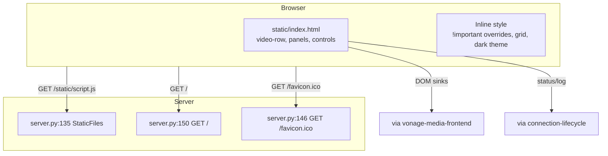
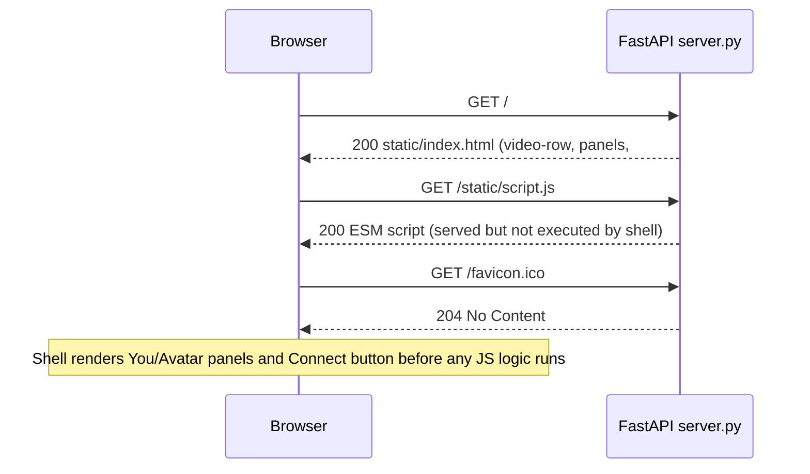

# Design Document: frontend-shell

## Overview

**Purpose:** Deliver the single-page UI and static delivery foundation for the AI Avatar Assistant. The shell renders the two-pane video layout and connection controls via `static/index.html:33`/`52` and serves them through `server.py:135`/`150`, providing the visual mount points (`userVideoContainer`, `anam-avatar`, `subscriberContainer`) that `vonage-media-frontend` and `text-bridge-avatar` populate.

**Users:** End-users opening `GET /` in a browser; operators verifying deployment via `GET /health` (owned by `ops-deployment` but shares same origin).

**Impact:** No existing UI is replaced — greenfield shell. Changes are additive: new `static/` files and static mounts on FastAPI. No DB migration.

### Goals
- Render a 960px centered two-pane layout with dark theme and square video wrappers without build tools
- Expose `userVideoContainer`/`anam-avatar` DOM sinks that downstream media modules can inject without layout reflow
- Serve `index.html` and `/static/*` from a single origin with correct MIME and 204 for favicon
- Keep total payload < 30KB and zero bundler dependency

### Non-Goals
- Vonage OT session creation, token handling, or `OT.initPublisher` logic (→ `vonage-media-frontend`)
- Anam SDK initialization or TTS streaming (→ `text-bridge-avatar`)
- Connection orchestration or `isConnected` state (→ `connection-lifecycle`)
- Audio processing, tunnel, or Docker concerns

## Boundary Commitments

### This Spec Owns
- `static/index.html` structure, CSS rules, and DOM IDs (`userVideoContainer`, `avatarContainer`, `anam-avatar`, `subscriberContainer`, `connectBtn`, `status`, `log`)
- `server.py:135` `StaticFiles(directory="static")` mount, `server.py:150` `GET / → FileResponse`, `server.py:146` `GET /favicon.ico → 204`
- Video wrapper aspect preservation (`::after {padding-bottom:100%}`) and `!important` overrides for Vonage-injected styles (temporary, see Revalidation)

### Out of Boundary
- Any JavaScript in `static/script.js` beyond DOM presence (logic belongs to `vonage-media-frontend`/`text-bridge-avatar`/`connection-lifecycle`)
- `POST /api/*`, `/ws`, `/ws-anam` (→ `session-provisioning`, `audio-connector-bridge`, `text-bridge-avatar`)
- Styling of Vonage-published video tracks beyond container (Vonage owns track internals)

### Allowed Dependencies
- FastAPI `StaticFiles`, `FileResponse`, `Response` (framework)
- Browser DOM/CSS only; no external CSS frameworks
- No upstream spec dependency (Wave 1 independent)

### Revalidation Triggers
- DOM ID rename (`userVideoContainer`/`anam-avatar` etc.) — breaks `vonage-media-frontend` and `text-bridge-avatar`
- `GET /` contract change (e.g., adding SSR or templating) — breaks `connection-lifecycle` mount assumption
- Removal of `!important` overrides without Vonage style isolation — breaks video layout
- Adding build step (vite/webpack) — invalidates zero-build guarantee

## Architecture

### Existing Architecture Analysis
*Pattern:* Monolith FastAPI serving both API and static — no SPA framework. Constraints: must remain single-origin to avoid CORS for `/static/script.js` ESM import; must support `opentok.min.js` global `OT` loaded before `script.js` via `<script src>`.
*Debt addressed:* Inline `<style>` is intentional zero-build debt; noted in Requirement 6 for future extraction to `static/style.css`.

### Architecture Pattern & Boundary Map



**Architecture Integration:**
- Selected pattern: Static Shell (server-rendered HTML + client DOM sinks) — minimal JS, no framework overhead, matches demo scope.
- Domain boundaries: Shell owns DOM/CSS; media modules own imperative DOM mutation via `srcObject` and `OT.initPublisher(container)`; lifecycle owns `status`/`log` text updates.
- Existing patterns preserved: Single FastAPI origin, no CDN, inline CSS.
- Steering compliance: `tech.md` System Components Map (Browser UI Shell) preserved; `product.md` Architecture Overview (Browser plane) unchanged.

### Technology Stack

| Layer | Choice / Version | Role in Feature | Notes |
|-------|------------------|-----------------|-------|
| Frontend / CLI | HTML5 + CSS3 (no framework) | Layout, panels, wrappers | Grid `video-row`, `video-wrapper::after` aspect |
| Backend / Services | FastAPI `StaticFiles`, `FileResponse` | Serve `static/` and `index.html` | Mount at `/static` |
| Data / Storage | None | — | No persistence |
| Messaging / Events | DOM `textContent` updates | `status`/`log` | No WebSocket here |
| Infrastructure / Runtime | Uvicorn `0.0.0.0:8005` | Host shell | Same port as other specs |

## File Structure Plan

### Directory Structure
```
static/
├── index.html          # Single-page shell: layout, styles, DOM sinks (60 lines max)
└── script.js           # Owned by other specs — shell only guarantees its mount path via /static
server.py               # Modified: static mounts and root/favicon handlers
```

### Modified Files
- `static/index.html` — Create if not exists; owns all DOM IDs and CSS. Single responsibility: define sinks and styles, no business logic.
- `server.py` — Add `app.mount("/static", StaticFiles(directory="static"), name="static")` at `135`, `@app.get("/favicon.ico") → 204` at `146`, `@app.get("/") → FileResponse("static/index.html")` at `150`. Each handler is one-liner, no auth.

## System Flows



*Decisions:* Shell renders before `script.js` type=module executes, so `DOMContentLoaded` not needed; `opentok.min.js` loaded via classic script before module to expose global `OT`.

## Requirements Traceability

| Requirement | Summary | Components | Interfaces | Flows |
|-------------|---------|------------|------------|-------|
| 1.1-1.6 | Single-page layout | `IndexHtmlLayout` | `GET /` | Shell render flow |
| 2.1-2.3 | Avatar video area | `AvatarVideoSink` | DOM `anam-avatar` | — |
| 3.1-3.5 | Controls/status/log | `ControlPanel` | DOM `connectBtn/status/log` | — |
| 4.1-4.4 | Static/fav handling | `StaticDelivery` | `GET /`, `/static/*`, `/favicon.ico` | Shell render flow |
| 5.1-5.5 | Non-functional | `IndexHtmlLayout` | — | — |
| 6.1-6.3 | Refactoring notes | — | — | — |

## Components and Interfaces

| Component | Domain/Layer | Intent | Req Coverage | Key Dependencies (P0/P1) | Contracts |
|-----------|--------------|--------|--------------|--------------------------|-----------|
| `IndexHtmlLayout` | UI | Defines two-pane grid, panels, wrappers, dark theme | 1, 5 | None | DOM, CSS |
| `AvatarVideoSink` | UI | Provides `video#anam-avatar` sink for Anam MediaStream | 2 | `IndexHtmlLayout` (P0) | DOM State |
| `ControlPanel` | UI | Renders `connectBtn`, `status`, `log` controls | 3 | `IndexHtmlLayout` (P0) | DOM State |
| `StaticDelivery` | Backend | Serves `index.html` and `/static/*`, 204 for favicon | 4 | `IndexHtmlLayout` (P0) | API |

### Frontend / Static

#### IndexHtmlLayout

| Field | Detail |
|-------|--------|
| Intent | Single responsibility: define DOM sinks and CSS without JS logic |
| Requirements | 1.1, 1.2, 1.3, 1.4, 1.5, 1.6, 5.2, 5.4, 5.5, 6.1, 6.2, 6.3 |
| Owner / Reviewers | — |

**Responsibilities & Constraints**
- Owns `.container`, `.video-row` (grid 1fr 1fr), `.video-panel`, `.video-wrapper` with `::after` aspect, `#subscriberContainer` hidden.
- Must keep `<html lang="ja">` at `2` and inline `<style>` until extraction (6.3).
- Invariant: DOM IDs `userVideoContainer`, `anam-avatar`, `connectBtn`, `status`, `log`, `subscriberContainer` are stable contracts.

**Dependencies**
- Outbound: `vonage-media-frontend` — injects video into `userVideoContainer` (P0)
- Outbound: `text-bridge-avatar` — sets `anam-avatar.srcObject` (P0)

**Contracts**: Service [ ] / API [ ] / Event [ ] / Batch [ ] / State [x]

##### State Management
- State model: Static DOM; no JS state owned.
- Persistence & consistency: File on disk `static/index.html`; served verbatim.
- Concurrency strategy: Read-only; safe for concurrent `GET /`.

**Implementation Notes**
- Integration: `opentok.min.js` `<script>` must precede `<script type=module src="/static/script.js">` to expose global `OT` before ESM runs.
- Validation: Verify `GET /` returns 200 with `video-row` class present; verify `GET /static/script.js` MIME `application/javascript`.
- Risks: `!important` debt at `19`; future Vonage SDK change may require selector update — see Revalidation.

#### AvatarVideoSink

| Field | Detail |
|-------|--------|
| Intent | Provide absolute-positioned `video#anam-avatar` sink that fills right pane with `object-fit:cover` |
| Requirements | 2.1, 2.2, 2.3 |

**Responsibilities & Constraints**
- Must apply `width:100%; height:100%; object-fit:cover; border-radius:8px; position:absolute; top:0; left:0` at `21`.
- Must have black fallback wrapper `background:#000` at `18` when no stream.
- Invariant: `autoplay` and `playsinline` attributes must be present to allow iOS autoplay after user gesture.

**State Management**
- State model: `HTMLVideoElement.srcObject` set by downstream spec; shell provides element only.
- Concurrency strategy: Single writer (`text-bridge-avatar`).

### Backend

#### StaticDelivery

| Field | Detail |
|-------|--------|
| Intent | Serve shell and assets from single FastAPI origin |
| Requirements | 4.1, 4.2, 4.3, 4.4 |
| Owner / Reviewers | — |

**Responsibilities & Constraints**
- Serves `static/` via `StaticFiles` at `135` with directory `static` (relative to `server.py`).
- `GET /` returns `FileResponse("static/index.html")` at `152`; path is literal, not templated.
- `GET /favicon.ico` returns `204` at `148` to avoid 404 logs.
- Invariant: No auth, no rate limit on these routes.

**Dependencies**
- External: FastAPI `StaticFiles`, `FileResponse` (P0)

**Contracts**: Service [ ] / API [x] / Event [ ] / Batch [ ] / State [ ]

##### API Contract
| Method | Endpoint | Request | Response | Errors |
|--------|----------|---------|----------|--------|
| GET | `/` | — | `text/html` static/index.html | 404 if file missing |
| GET | `/static/{path}` | — | file from `static/` | 404 |
| GET | `/favicon.ico` | — | 204 No Content | — |

**Implementation Notes**
- Validation: `curl http://localhost:8005/` → 200 with `video-row`; `curl -I /static/script.js` → 200 `application/javascript`; `curl -I /favicon.ico` → 204.
- Risks: Missing `static/` dir causes 500 on `GET /`; ensure `#subscriberContainer video display:none` redundancy flagged in Req 6.1 does not mask missing file errors.

## Data Models

### Domain Model
No domain entities; shell is stateless. DOM IDs are value objects (stable identifiers). `GET /` response is verbatim file content — no transformation.

### Logical Data Model
**Structure Definition:**
- `index.html` — opaque HTML document, 59 lines, UTF-8.
- `StaticFiles` — serves any file under `static/` with MIME sniffing.

**Consistency & Integrity:**
- Transaction boundaries: None (read-only).
- Cascading rules: Renaming DOM ID requires atomic update in `vonage-media-frontend` and `text-bridge-avatar`.

### Data Contracts & Integration

**API Data Transfer**
- `GET /` → `text/html` (Japanese literals `あなた`, `AIアバター`, `接続`, `切断されています`).
- `GET /static/script.js` → `application/javascript` ESM.

## Error Handling

### Error Strategy
- Missing `static/index.html` → FastAPI returns 404 (file not found) — shell must not catch and mask as 200.
- Missing `/static/*` → 404 without stack trace (FastAPI default).

### Error Categories and Responses
**User Errors (4xx):** `404` for missing static file → browser shows 404; no field validation here.
**System Errors (5xx):** `500` if `static/` mount fails at startup (wrong directory) → log via `logger.exception`.
**Business Logic Errors (422):** None (no business logic).

### Monitoring
- No metrics for shell; `ops-deployment` `GET /health` covers liveness. Shell errors surface via Uvicorn access log.

## Testing Strategy

- **Unit Tests:** Verify `index.html` contains expected DOM IDs (`userVideoContainer`, `anam-avatar`, `connectBtn`, `status`, `log`, `subscriberContainer`) via `BeautifulSoup` parse; verify CSS contains `video-row` and `padding-bottom:100%`.
- **Integration Tests:** `TestClient` GET `/` → 200 with `video-row`; GET `/static/script.js` → 200; GET `/favicon.ico` → 204; missing `/static/missing.js` → 404.
- **E2E/UI Tests:** Playwright loads `/` → two panels visible, Connect button green `Connect`, status `Disconnected`, log auto-scroll check.
- **Performance/Load:** Shell TTFB < 50ms for `GET /` (small file); no DB.

## Security Considerations
- `d.textContent` for `log` at `static/script.js:20` is XSS-safe (shell documents but downstream implements). Shell must not switch to `innerHTML`.

## Performance & Scalability
- Small static file (< 10KB HTML + CSS inline); no caching headers currently — future `StaticFiles` should add `Cache-Control` after extraction to `style.css` (see Req 6.3).

## Supporting References
- Vonage OT style injection docs: `https://tokbox.com/developer/sdks/js/reference/OT.html` (for `!important` rationale) — pointer to `research.md` if needed.
