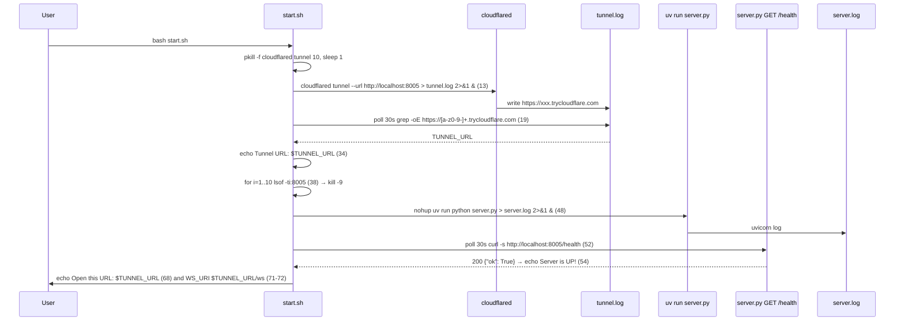
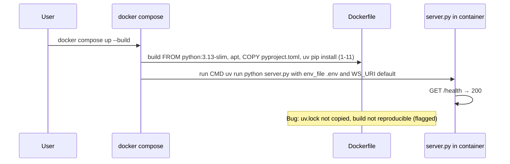

# Design Document: ops-deployment

## Overview

**Purpose:** Provide the operational layer for health, tunnel, startup, Docker, and dependency management. Integrates `GET /health` at `server.py:155`, `cloudflared tunnel --url :8005` polling at `start.sh:8-34`, port free and `uv run python server.py` at `start.sh:38-48` with `curl /health` wait at `52`, `python:3.13-slim` Docker at `Dockerfile:1-17`, `WS_URI` propagation and `private.key` volume at `docker-compose.yml:8`, and `pyproject.toml:5` dependencies resolved via `uv.lock`.

**Users:** Developer running `bash start.sh` locally and operator running `docker compose up --build`.

**Impact:** Adds no API beyond `GET /health`; adds `start.sh` process orchestration and containerization. Requires `cloudflared`, `lsof`, `curl`, `uv`.

### Goals
- Health endpoint responds  `{"ok": True}` within 10ms without auth
- Tunnel starts, polls `tunnel.log` for `https://[a-z0-9-]+\.trycloudflare\.com` within 30s, prints `WS_URI` suggestion
- Port 8005 freed via `lsof -ti:8005`/`kill -9` loop and server started via `nohup uv run` with `curl /health` wait 30s
- Docker builds reproducibly from `python:3.13-slim` and runs via `docker-compose` with `WS_URI` env and `private.key:ro`

### Non-Goals
- Vonage/Anam token issuance or pipeline
- Frontend layout or Vonage media
- Business logic beyond `GET /health`

## Boundary Commitments

### This Spec Owns
- `server.py:155` `GET /health` handler
- `start.sh:8-73` tunnel lifecycle (pkill, `cloudflared tunnel --url`, 30s grep poll, `TUNNEL_URL` echo), server lifecycle (lsof kill loop 38, `nohup uv run` 48, `curl /health` poll 52, `TUNNEL_URL` final echo 68-72)
- `Dockerfile:1-17` (`FROM python:3.13-slim`, `apt-get build-essential curl`, `COPY pyproject.toml`, `uv pip install -r pyproject.toml`, `EXPOSE 8005`, `CMD ["uv","run","python","server.py"]`)
- `docker-compose.yml:1-13` (`version` deprecated, `env_file`, `environment WS_URI`, `volumes private.key:ro`, `ports 8005:8005`)
- `pyproject.toml:5` dependencies and `uv.lock` commitment, `.gitignore:6,9,10` for `.env`/`private.key`/`*.log`

### Out of Boundary
- `POST /api/*` contracts (→ `session-provisioning`)
- `/ws` and `/ws-anam` (→ `audio-connector-bridge`/`text-bridge-avatar`)
- Vonage `Auth` creation

### Allowed Dependencies
- `cloudflared` binary, `lsof`, `curl`, `nohup` (host); `uv`, `pip` (container); `uv.lock` (local)
- No upstream spec beyond `session-provisioning` env vars (`VONAGE_*`/`ANAM_*`/`WS_URI`)

### Revalidation Triggers
- `GET /health` response shape change (`{"ok": True}`) — breaks `start.sh:53` `curl -s .../health` wait and external monitoring
- `start.sh` tunnel regex or `TUNNEL_URL` echo format change — breaks `WS_URI` suggestion for `session-provisioning`
- `Dockerfile` base image or `COPY`/`uv pip install` change — breaks reproducibility (`uv.lock` flagged)
- `docker-compose.yml` `WS_URI` default change — breaks Vonage Audio Connector URI

## Architecture

### Existing Architecture Analysis
*Pattern:* Bash orchestration for tunnel + server with log polling. Existing `start.sh` uses broad `pkill -f`, `lsof` without fallback, `nohup` without `trap`, and `TUNNEL_LOG` grep for trycloudflare URL; `Dockerfile` ignores `uv.lock`; `version: "3.9"` deprecated.
*Constraints:* Must work on macOS (where `lsof` exists) and in Docker (where `lsof` may not); `cloudflared` must be pre-installed.

### Architecture Pattern & Boundary Map

```mermaid
graph TB
  subgraph Host start.sh
    KillOld[pkill cloudflared 10<br/>kill existing]
    Tunnel[cloudflared tunnel --url :8005 13<br/>background to tunnel.log]
    PollTun[Poll 30s grep trycloudflare<br/>19-26<br/>TUNNEL_URL]
    Lsof[lsof -ti:8005 kill -9 loop<br/>38-46]
    Nohup[nohup uv run python server.py 48<br/>to server.log]
    PollHealth[Poll 30s curl /health 52<br/>Server is UP!]
  end
  subgraph Server server.py
    Health[GET /health 155<br/>{"ok":True}]
  end
  subgraph Docker
    DFile[Dockerfile 1<br/>python:3.13-slim, uv]
    Compose[docker-compose.yml 1<br/>WS_URI, private.key:ro]
  end
  Tunnel --> PollTun --> Lsof --> Nohup --> PollHealth --> Health
  DFile --> Compose --> Health
```

**Architecture Integration:**
- Pattern: Scripted Process Orchestration (tunnel + server) with polling healthchecks; Containerized Deployment (Docker).
- Boundaries: This spec owns orchestration and container; `audio-connector-bridge` owns `VONAGE_AUDIO_RATE` env reading (but supplied here via `docker-compose` env).
- Preserved: `cloudflared` background, `grep -oE` regex, `lsof` kill loop, `nohup uv run`, `curl /health` polls, `uv pip install -r pyproject.toml` (flagged), `WS_URI` default `ws://localhost:8005/ws`.
- Steering: `tech.md` Development Environment (Required Tools/Common Commands/Env Vars) preserved; `tech.md` Infra Tunnel decision preserved.

### Technology Stack

| Layer | Choice / Version | Role in Feature | Notes |
|-------|------------------|-----------------|-------|
| Backend / Services | FastAPI `GET /health` | Liveness probe | 10ms target |
| Infrastructure / Runtime | `cloudflared tunnel` CLI | Expose `http://localhost:8005` as `https://*.trycloudflare.com` | `--url` |
| Infrastructure / Runtime | `bash`, `nohup`, `lsof`, `curl`, `grep -oE` | Orchestrate tunnel+server | `start.sh` |
| Infrastructure / Runtime | Docker `python:3.13-slim-bookworm`, `build-essential`, `curl`, `uv` | Container image | `EXPOSE 8005` |
| Data / Storage | `.env`, `private.key`, `tunnel.log`, `server.log` | Config and logs | Gitignored except `.env.example` |

## File Structure Plan

### Directory Structure
```
server.py               # Modified: GET /health 155
start.sh                # Script: tunnel 8-34, server 38-73
Dockerfile              # Image: base 1, apt 5, copy 10, uv install 11, expose 15, cmd 16
docker-compose.yml      # Compose: version 1, env_file 8-9, environment 10-11, volumes 12
pyproject.toml          # Deps: requires-python 5, dependencies 6-14
uv.lock                 # Lock file (committed, but not used in Dockerfile — flagged)
.gitignore              # Patterns: .env 6, private.key 9, *.log 10
tunnel.log              # Runtime: cloudflared output (gitignored)
server.log              # Runtime: uv run output (gitignored)
```

### Modified Files
- `server.py` — Add `@app.get("/health")` at `155` returning `{"ok": True}` (200 JSON). Single responsibility: liveness.
- `start.sh` — Create if not exists; owns tunnel `pkill`/`cloudflared`/`grep` loop (8-34) and server `lsof`/`nohup`/`curl` loop (38-63) and final echoes (68-72). Each phase is `for i in $(seq 1 30)` polling with `tail` on failure.
- `Dockerfile` — Add `FROM python:3.13-slim` at `1`, `apt-get install build-essential curl` at `5`, `COPY pyproject.toml .` at `10`, `RUN pip install uv && uv pip install --system -r pyproject.toml` at `11` (flagged ignoring `uv.lock`), `EXPOSE 8005` at `14`, `CMD ["uv","run","python","server.py"]` at `16`.
- `docker-compose.yml` — Add `version: "3.9"` at `1` (flagged deprecated), `env_file: .env` at `8`, `environment: WS_URI=${WS_URI:-ws://localhost:8005/ws}` at `10-11`, `volumes: ./private.key:/app/private.key:ro` at `12`.

## System Flows



*Decisions:* `pkill` before `cloudflared` prevents duplicate tunnels; `grep -oE` regex assumes trycloudflare subdomain lowercase; `lsof` loop ensures port free before `nohup`; `curl /health` polls ensures server ready before printing URL. `CLOUDFLARED_PID` logged at `14` but never trapped for cleanup (flagged gap).



## Requirements Traceability

| Requirement | Summary | Components | Interfaces | Flows |
|-------------|---------|------------|------------|-------|
| 1.1-1.3 | Health | `HealthEndpoint` | `GET /health` | Health poll |
| 2.1-2.5 | Tunnel | `TunnelOrchestration` | `cloudflared tunnel`, `tunnel.log` | Tunnel flow |
| 3.1-3.5 | Server start | `ServerStartup` | `lsof`, `nohup`, `curl /health` | Startup flow |
| 4.1-4.5 | Docker | `ContainerImage`, `ComposeService` | `Dockerfile`, `docker-compose.yml` | Docker flow |
| 5.1-5.5 | Deps | `DependencyManagement` | `pyproject.toml`, `uv.lock` | — |
| 6.1-6.6 | Non-functional | All | — | — |

## Components and Interfaces

| Component | Domain/Layer | Intent | Req Coverage | Key Dependencies (P0/P1) | Contracts |
|-----------|--------------|--------|--------------|--------------------------|-----------|
| `HealthEndpoint` | Backend | Liveness probe | 1 | None | API |
| `TunnelOrchestration` | Infra | Start cloudflared and extract public URL | 2 | `HealthEndpoint` (P1) | Service |
| `ServerStartup` | Infra | Free port and start server with health wait | 3 | `TunnelOrchestration` (P0), `HealthEndpoint` (P0) | Service |
| `ContainerImage` | Infra | Build reproducible image | 4.1-4.3, 5, 6 | `DependencyManagement` (P0) | Service |
| `ComposeService` | Infra | Run container with env and volume | 4.4-4.5, 6 | `ContainerImage` (P0) | Service |
| `DependencyManagement` | Infra | Declare `pyproject.toml` / `uv.lock` / `.gitignore` | 5 | None | Service |

### Backend

#### HealthEndpoint

| Field | Detail |
|-------|--------|
| Intent | Fast 10ms liveness probe for `start.sh` and Docker `curl` |
| Requirements | 1.1, 1.2, 1.3, 6.5 |
| Owner / Reviewers | — |

**Responsibilities & Constraints**
- `@app.get("/health")` at `155` returns `JSONResponse({"ok": True})` (`server.py:157`) with 200; no auth, no external calls.
- No rate limit; used by `start.sh:53` `curl -s http://localhost:8005/health` and Docker `HEALTHCHECK` (future).

**Contracts**: Service [ ] / API [x] / Event [ ] / Batch [ ] / State [ ]

##### API Contract
| Method | Endpoint | Request | Response | Errors |
|--------|----------|---------|----------|--------|
| GET | `/health` | — | `200 {"ok": true}` | — |

**Implementation Notes**
- Validation: `curl http://localhost:8005/health` → 200 `{"ok": true}` <10ms; `TestClient` GET → 200.
- Risks: None; trivial.

#### TunnelOrchestration

| Field | Detail |
|-------|--------|
| Intent | Manage `cloudflared` lifecycle and extract `TUNNEL_URL` for `WS_URI` |
| Requirements | 2.1, 2.2, 2.3, 2.4, 2.5, 6.3, 6.6 |
| Owner / Reviewers | — |

**Responsibilities & Constraints**
- `pkill -f "cloudflared tunnel" 2>/dev/null || true; sleep 1` at `10` — broad kill (flagged, should use PID file).
- `cloudflared tunnel --url http://localhost:8005 > "$TUNNEL_LOG" 2>&1 &` at `13` then `CLOUDFLARED_PID=$!; echo cloudflared PID: $CLOUDFLARED_PID` — PID never trapped (gap).
- Poll `for i in $(seq 1 30); do TUNNEL_URL=$(grep -oE 'https://[a-z0-9-]+\.trycloudflare\.com' "$TUNNEL_LOG" | head -n 1 || true); if [ -n "$TUNNEL_URL" ]; then break; fi; sleep 1; done` at `19-26`.
- On success `echo "Tunnel URL: $TUNNEL_URL"` at `34`; on failure `tail -n 10 "$TUNNEL_LOG"; exit 1` at `28-31`.
- Regex `https://[a-z0-9-]+\.trycloudflare\.com` assumes lowercase (implicit rule now explicit).

**Contracts**: Service [x] / API [ ] / Event [ ] / Batch [ ] / State [ ]

##### Service Interface
```bash
TUNNEL_LOG="$SCRIPT_DIR/tunnel.log"
pkill -f "cloudflared tunnel"  # 10
cloudflared tunnel --url http://localhost:8005 > "$TUNNEL_LOG" 2>&1 &  # 13
TUNNEL_URL=$(grep -oE 'https://[a-z0-9-]+\.trycloudflare\.com' "$TUNNEL_LOG")  # 20
```
- Preconditions: `cloudflared` installed at `command -v cloudflared` (gap: no explicit check, `set -e` will fail).
- Postconditions: `TUNNEL_URL` non-empty or exit 1; `tunnel.log` contains trycloudflare URL.

**Implementation Notes**
- Validation: Run `bash -x start.sh` → grep finds URL within 30s; kill prior tunnel manually then re-run → new URL differs.
- Risks: `pkill` broad; missing `trap "kill $CLOUDFLARED_PID"` on EXIT.

#### ServerStartup

| Field | Detail |
|-------|--------|
| Intent | Ensure port free, start server, wait for health |
| Requirements | 3.1, 3.2, 3.3, 3.4, 3.5, 6.4, 6.6 |
| Owner / Reviewers | — |

**Responsibilities & Constraints**
- Loop `for i in $(seq 1 10); do pid=$(lsof -ti:8005 2>/dev/null || true); if [ -z "$pid" ]; then break; fi; kill -9 "$pid"; sleep 1; done` at `38-46` — `lsof` may not exist in minimal image (gap: fallback to `ss`/`fuser` needed).
- `cd "$SCRIPT_DIR" && nohup uv run python server.py > "$SERVER_LOG" 2>&1 &` at `48` — `nohup` orphans (legacy, should use `exec` or `systemd`).
- Poll `for i in $(seq 1 30); do if curl -s http://localhost:8005/health > /dev/null; then echo "Server is UP!"; break; fi; if [ $i -eq 30 ]; then tail -n 20 "$SERVER_LOG"; exit 1; fi; sleep 1; done` at `52-63`.

**Contracts**: Service [x] / API [ ] / Event [ ] / Batch [ ] / State [ ]

### Infra / Container

#### ContainerImage

| Field | Detail |
|-------|--------|
| Intent | Build deterministic image from slim base |
| Requirements | 4.1, 4.2, 4.3, 5.1, 5.2, 6.1, 6.2 |
| Owner / Reviewers | — |

**Responsibilities & Constraints**
- `FROM python:3.13-slim-bookworm` at `1` satisfies `requires-python >=3.11` from `pyproject.toml:5`.
- `RUN apt-get update && apt-get install -y build-essential curl && rm -rf /var/lib/apt/lists/*` at `5-8`.
- `COPY pyproject.toml .` at `10` then `RUN pip install --no-cache-dir uv && uv pip install --system -r pyproject.toml` at `11` — ignores `uv.lock` (bug flagged: should `COPY pyproject.toml uv.lock` and `RUN uv sync --frozen` or `uv pip install -r uv.lock`).
- `EXPOSE 8005` at `14` (docs only), `CMD ["uv","run","python","server.py"]` at `16` — no `HEALTHCHECK` (gap: should add `HEALTHCHECK CMD curl -f http://localhost:8005/health || exit 1`).

**Contracts**: Service [x] / API [ ] / Event [ ] / Batch [ ] / State [ ]

#### ComposeService

| Field | Detail |
|-------|--------|
| Intent | Run container with env and volume wiring |
| Requirements | 4.4, 4.5, 5.3, 6.1, 6.4 |
| Owner / Reviewers | — |

**Responsibilities & Constraints**
- `version: "3.9"` at `1` deprecated in Compose Spec v2 — shall be removed (flagged).
- `env_file: .env` at `8-9` loads `.env` into container; `environment: WS_URI=${WS_URI:-ws://localhost:8005/ws}` at `10-11` defaults to `ws://` (gap: prod `wss` when tunnel used, should default to `wss` if tunnel).
- `volumes: ./private.key:/app/private.key:ro` at `12` mounts private key read-only.
- `ports: "8005:8005"` at `7` exposes health and APIs.

**Contracts**: Service [x] / API [ ] / Event [ ] / Batch [ ] / State [ ]

#### DependencyManagement

| Field | Detail |
|-------|--------|
| Intent | Declare dependencies reproducibly |
| Requirements | 5.1, 5.2, 5.3, 5.4, 5.5, 6.2 |
| Owner / Reviewers | — |

**Responsibilities & Constraints**
- `pyproject.toml:5` `requires-python >=3.11` and `dependencies` list `pipecat-ai[...]`, `vonage`, `vonage-video`, `python-dotenv`, `uvicorn[standard]`, `fastapi`, `anam`.
- `uv.lock` committed for reproducibility (should be used in `Dockerfile`).
- `.gitignore:6` `.env`, `9` `private.key`, `10` `*.log` — prevents leakage of tunnel URLs and secrets.

**Contracts**: Service [x] / API [ ] / Event [ ] / Batch [ ] / State [ ]

## Data Models

### Domain Model
No domain entities; `TUNNEL_URL: string` (`https://xxx.trycloudflare.com`), `WS_URI: string` (`wss://host/ws` or `ws://`), `HealthResponse{ok: true}`.

### Logical Data Model
**Structure Definition:**
- `TunnelLog` — plain text file with `cloudflared` output lines, one `https://*.trycloudflare.com` line expected.
- `HealthResponse` — JSON `{"ok": boolean}`.

### Data Contracts & Integration
- `GET /health` JSON `{"ok": true}` — contract for `start.sh:53` curl.
- `TUNNEL_URL` string — contract for `echo "${TUNNEL_URL}"` and `WS_URI` suggestion `${TUNNEL_URL}/ws`.

## Error Handling

### Error Strategy
- Tunnel no URL in 30s → `tail -n 10 tunnel.log` + `exit 1` at `28-31`.
- Port not free after 10 kills → loop ends but `nohup` still runs; may fail to bind (gap: should exit if port still busy).
- Server health no `curl` success in 30s → `tail -n 20 server.log` + `exit 1` at `57-60` (tunnel not cleaned).
- Docker build failure → `apt-get` or `uv pip install` non-zero exit (due to `set -e` not in Dockerfile, but `docker build` fails).

### Error Categories and Responses
**User Errors (4xx):** None.
**System Errors (5xx):** `GET /health` always 200; `cloudflared not found` → `start.sh` fails via `set -e` before health wait (gap: no explicit `command -v` check, should add).
**Business Logic Errors (422):** None.

### Monitoring
- `tunnel.log` and `server.log` are written via `>` and `nohup ... >`; logs unbounded (gap: rotate or `logrotate`).
- No metrics; `GET /health` could be scraped.

## Testing Strategy

- **Unit Tests:** `GET /health` → 200 `{"ok": true}` via `TestClient`; `Dockerfile` `pyproject.toml` copy exists; `docker-compose.yml` env `WS_URI` default.
- **Integration Tests:** `bash start.sh` mock `cloudflared` script that writes fake trycloudflare URL to `tunnel.log` → verify `TUNNEL_URL` extracted in <30s; mock `lsof` returning PID → verify `kill -9` loop; mock `curl /health` 200 → `Server is UP!`.
- **E2E/UI Tests:** Real `cloudflared` (if installed) `bash start.sh` → open printed URL in Playwright → health visible; `docker compose up --build` → `curl http://localhost:8005/health` 200.
- **Performance/Load:** Health <10ms; tunnel start <15s typical; Docker build <2 min.

## Security Considerations
- `private.key` `ro` mount prevents container overwrite; `.gitignore` prevents commit of `.env`/`private.key`/`*.log`.
- `tunnel.log` contains public `https://*.trycloudflare.com` — gitignored but world-readable on host; should `chmod 600`.
- `GET /health` no auth intentional; other `POST /api/*` 500 on missing env separates health from auth.

## Performance & Scalability
- Health is O(1) no DB; tunnel is single `cloudflared` process per `start.sh`; server is single `uvicorn` process (no workers).
- Log polling every 1s for 30s is low overhead; no horizontal scaling in demo.

## Supporting References
- `cloudflared tunnel`: `https://developers.cloudflare.com/cloudflare-one/connections/connect/networks/downloads/`; `uv sync --frozen`: `https://github.com/astral-sh/uv`.

## Migration Strategy
- Future move from `nohup` to `systemd` or `docker-compose` only: add `trap "kill $CLOUDFLARED_PID"` at top of `start.sh`; remove `lsof` kill loop in Docker (handled by `docker-compose down`).
