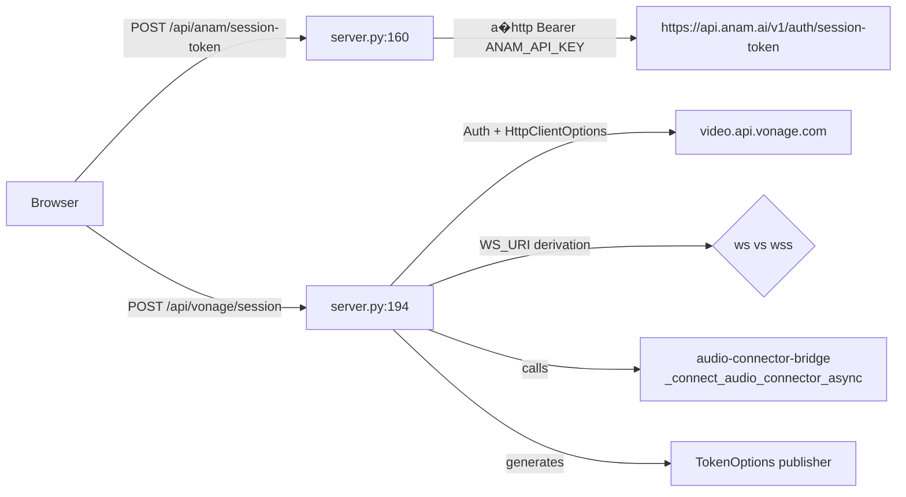
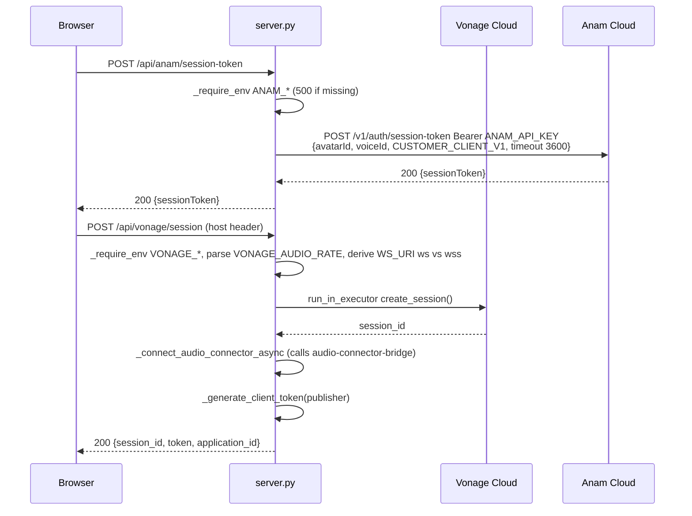

# Design Document: session-provisioning

## Overview

**Purpose:** Provide the REST issuance layer for Vonage Video and Anam avatar sessions. Exposes `POST /api/anam/session-token` (`server.py:160`) and `POST /api/vonage/session` (`server.py:194`) plus Vonage client helpers (`server.py:44`/`119`/`30`/`37`), enabling the browser to obtain all tokens in one round-trip without frontend exposure of `ANAM_API_KEY` or `private.key`.

**Users:** Browser `connection-lifecycle` (5-step orchestration) and any future client needing `OT.initSession` credentials. Also consumed by `audio-connector-bridge` for `ws_uri`/`session_id`.

**Impact:** Adds two POST endpoints to existing FastAPI `server.py`. No DB. Fails fast with 500/502 if env missing.

### Goals
- Validate env (`VONAGE_*`, `ANAM_*`) and private-key (PEM vs path) before external calls
- Proxy Anam token with fixed `personaConfig`/`sessionOptions` and 502 on non-200
- Create Vonage session, connect Audio Connector, and generate publisher token atomically per request (no shared session reuse)
- Derive `WS_URI` correctly (`ws` for localhost, `wss` otherwise) with explicit validation

### Non-Goals
- Audio Connector lifecycle beyond single creation (→ `audio-connector-bridge` owns `_active_connectors` stop/start)
- `/ws` and `/ws-anam` handling
- Frontend OT/Anam SDK logic, STT/LLM, tunnel

## Boundary Commitments

### This Spec Owns
- `POST /api/anam/session-token` and `POST /api/vonage/session` contracts and handlers
- Vonage `Auth`/`HttpClientOptions` creation at `44`, `TokenOptions`/`generate_client_token` at `50`, `_create_session_async` at `59`
- Env helpers `_require_env` at `30` and `_read_private_key` at `37` plus `load_dotenv` policy
- `WS_URI` derivation logic at `203` and `VONAGE_AUDIO_RATE` parsing at `201`

### Out of Boundary
- `_connect_audio_connector_async`/`_stop_audio_connector_async` internals beyond the single call from `create_vonage_session` (owned by `audio-connector-bridge`)
- `/ws` transport and `VonageFrameSerializer` (→ `audio-connector-bridge`)
- Anam avatar rendering (→ `text-bridge-avatar`)

### Allowed Dependencies
- `vonage`/`vonage-video` SDK, `aiohttp` for Anam proxy, `python-dotenv`, `loguru`
- `ops-deployment` provides `.env` and `private.key` file; this spec validates
- No circular dependency to `audio-connector-bridge` beyond the one call (direction is `session-provisioning` → `audio-connector-bridge` for `start_audio_connector`)

### Revalidation Triggers
- `POST /api/anam/session-token` request/response shape change (e.g., adding `personaConfig` fields) — breaks `text-bridge-avatar` Anam init
- `POST /api/vonage/session` response keys change (`session_id`/`token`/`application_id`) — breaks `vonage-media-frontend` OT init
- `VONAGE_PRIVATE_KEY` handling change (PEM vs path) — breaks `ops-deployment` Docker volume
- `WS_URI` scheme validation change — breaks `audio-connector-bridge` connector URI

## Architecture

### Existing Architecture Analysis
*Pattern:* FastAPI monolith with synchronous Vonage SDK offloaded via `run_in_executor`. Constraint: `vonage` SDK is sync — must not block event loop. Existing `load_dotenv(override=True)` is intentional demo behavior but flagged for prod (`override=False`).
*Debt to watch:* Unused `Request` param in Anam handler; `FileNotFoundError` not caught in `_read_private_key`.

### Architecture Pattern & Boundary Map



**Architecture Integration:**
- Pattern: Thin REST facade over vendor SDKs with env validation front-door.
- Boundaries: This spec owns validation and SDK client creation; `audio-connector-bridge` owns connector persistence.
- Preserved: `run_in_executor` offload, `Auth(video_host, timeout=30)`, `TokenOptions(role=publisher)`.
- Steering compliance: `tech.md` System Components Map (Server REST/Vonage Integration) preserved; `tech.md` Key Technical Decisions (Vonage I/O via thread pool) enforced.

### Technology Stack

| Layer | Choice / Version | Role in Feature | Notes |
|-------|------------------|-----------------|-------|
| Backend / Services | FastAPI `POST`, `HTTPException`, `JSONResponse` | Expose two endpoints | No auth |
| Backend / Services | `vonage==3.3.1`, `vonage-video`, `Auth`, `HttpClientOptions`, `TokenOptions`, `AudioConnectorOptions` | Create session/token and build connector opts | Sync SDK |
| Backend / Services | `aiohttp.ClientSession` | Proxy Anam token | Async HTTP |
| Data / Storage | None | — | — |
| Messaging / Events | None | — | — |
| Infrastructure / Runtime | `python-dotenv load_dotenv(override=True)`, `loguru` | Env & logging | Demo override |

## File Structure Plan

### Directory Structure
```
server.py               # Modified: add anam/vonage handlers and helpers (30,37,44,50,59,160,194)
.env.example            # Reference for required vars (no code change)
static/script.js        # No change; caller owned by connection-lifecycle
```

### Modified Files
- `server.py` — Add `_require_env` (30), `_read_private_key` (37), `_create_vonage_client` (44), `_generate_client_token` (50), `_create_session_async` (59), `POST /api/anam/session-token` (160), `POST /api/vonage/session` (194). Each helper is single-purpose; handlers delegate to them.

## System Flows



*Decisions:* `WS_URI` derived from `host` header only if `WS_URI` env missing; scheme `ws` for `localhost` prefix else `wss`. Validation for non-`ws`/`wss` scheme now required per Requirement 5.3.

## Requirements Traceability

| Requirement | Summary | Components | Interfaces | Flows |
|-------------|---------|------------|------------|-------|
| 1.1-1.6 | Anam token issuance | `AnamTokenHandler` | `POST /api/anam/session-token`, Anam `POST /v1/auth/session-token` | Anam flow |
| 2.1-2.8 | Vonage session | `VonageSessionHandler`, `VonageClientFactory` | `POST /api/vonage/session` | Vonage flow |
| 3.1-3.4 | Client/token creation | `VonageClientFactory` | `Auth`, `HttpClientOptions`, `TokenOptions` | — |
| 4.1-4.4 | Env/secret mgmt | `EnvHelper` | `_require_env`, `_read_private_key` | — |
| 5.1-5.6 | Error/security | `AnamTokenHandler`, `VonageSessionHandler` | 500/502 contracts | — |
| 6.1-6.4 | Implicit debt | `EnvHelper` | — | — |

## Components and Interfaces

| Component | Domain/Layer | Intent | Req Coverage | Key Dependencies (P0/P1) | Contracts |
|-----------|--------------|--------|--------------|--------------------------|-----------|
| `AnamTokenHandler` | Backend | Proxy Anam token without exposing key | 1, 5 | `EnvHelper` (P0), Anam Cloud (P0) | API |
| `VonageSessionHandler` | Backend | Create session, derive WS_URI, generate publisher token, call connector | 2, 5 | `VonageClientFactory` (P0), `EnvHelper` (P0), `audio-connector-bridge` (P1) | API |
| `VonageClientFactory` | Backend | Build `Auth`/`Vonage` with timeout and token helpers | 3 | `EnvHelper` (P1) | Service |
| `EnvHelper` | Backend | Validate env and load private key PEM/path | 4, 6 | None | Service |

### Backend

#### AnamTokenHandler

| Field | Detail |
|-------|--------|
| Intent | Securely proxy `ANAM_API_KEY` to Anam and return `sessionToken` |
| Requirements | 1.1, 1.2, 1.3, 1.4, 1.5, 1.6, 5.2, 5.5, 6.1, 6.2 |
| Owner / Reviewers | — |

**Responsibilities & Constraints**
- Validates `ANAM_API_KEY`, `ANAM_AVATAR_ID`, `ANAM_VOICE_ID` via `_require_env` — 500 if missing.
- Calls `aiohttp` with `personaConfig{avatarId, voiceId, llmId:"CUSTOMER_CLIENT_V1", enableAudioPassthrough:false}` and `sessionOptions{enableSessionReplay:false, sessionTimeout:3600}` — fixed contract.
- On non-200 logs `Anam token error: {status} {text}` and raises `HTTPException(502, "Failed to create Anam token")` without leaking key.
- Stateless per request; no shared state.

**Dependencies**
- Inbound: Browser `POST /api/anam/session-token` (P0)
- Outbound: Anam `https://api.anam.ai/v1/auth/session-token` via `aiohttp` (P0)
- Outbound: `EnvHelper._require_env` (P0)

**Contracts**: Service [ ] / API [x] / Event [ ] / Batch [ ] / State [ ]

##### API Contract
| Method | Endpoint | Request | Response | Errors |
|--------|----------|---------|----------|--------|
| POST | `/api/anam/session-token` | — (no body) | `200 {sessionToken: string}` | `500 Missing env var`, `502 Failed to create Anam token` |

**Implementation Notes**
- Validation: `pytest` POST with missing env → 500; mock Anam 401 → 502 without key in logs.
- Risks: `aiohttp` session per request — ensure `async with` closes.

#### VonageSessionHandler

| Field | Detail |
|-------|--------|
| Intent | Issue Vonage session+token+application_id and trigger Audio Connector with derived WS_URI |
| Requirements | 2.1-2.8, 3.4, 5.1, 5.3, 5.4, 5.6 |
| Owner / Reviewers | — |

**Responsibilities & Constraints**
- Validates `VONAGE_APPLICATION_ID`, `VONAGE_PRIVATE_KEY`; handles PEM vs path via `_read_private_key` with `FileNotFoundError` → 500 (new guard).
- Parses `VONAGE_AUDIO_RATE` with `int(..., "16000")` default; non-numeric → 500.
- Derives `WS_URI`: if `WS_URI` env set uses it; else `host = request.headers.get("host","localhost:8005")` and `scheme = "ws" if host.startswith("localhost") else "wss"` → `f"{scheme}://{host}/ws"`; validates scheme `ws://`/`wss://` else 500.
- Calls `_create_session_async` via `run_in_executor`, then `_connect_audio_connector_async`, then `_generate_client_token` (publisher) before returning.

**Dependencies**
- Inbound: Browser `POST /api/vonage/session` (P0)
- Outbound: `VonageClientFactory` (P0)
- Outbound: `audio-connector-bridge._connect_audio_connector_async` (P1)

**Contracts**: Service [ ] / API [x] / Event [ ] / Batch [ ] / State [ ]

##### API Contract
| Method | Endpoint | Request | Response | Errors |
|--------|----------|---------|----------|--------|
| POST | `/api/vonage/session` | — (reads `host` header) | `200 {session_id: string, token: string, application_id: string}` | `500 Missing env var`, `500 FileNotFoundError`, `500 int conversion`, `500 invalid WS_URI`, `500 Audio Connector error` |

**Implementation Notes**
- Integration: Call `vng.video.create_session()` via `run_in_executor` to avoid blocking; `AudioConnectorWebSocket(bidirectional=True)` fixed.
- Validation: Test `127.0.0.1` host → expect `wss` today (known limitation flagged) vs future `ws` fix.
- Risks: Duplicate `load_dotenv`; ensure `WS_URI` validation before connector call.

#### VonageClientFactory

| Field | Detail |
|-------|--------|
| Intent | Encapsulate `Auth`/`Vonage` creation and token generation with timeout and type normalization |
| Requirements | 3.1, 3.2, 3.3, 3.4 |
| Owner / Reviewers | — |

**Responsibilities & Constraints**
- `Auth(application_id, private_key)` + `HttpClientOptions(video_host="video.api.vonage.com", timeout=30)` at `44`.
- `TokenOptions(session_id, role="publisher")` then `bytes→decode` else `str` at `50`.
- `create_session` offloaded via `run_in_executor` at `59`.

**Contracts**: Service [x] / API [ ] / Event [ ] / Batch [ ] / State [ ]

##### Service Interface
```python
def _create_vonage_client(application_id: str, private_key: str) -> Vonage: ...
def _generate_client_token(vng: Vonage, session_id: str) -> str: ...
async def _create_session_async(vng: Vonage) -> str: ...
```
- Preconditions: `application_id` non-empty, `private_key` PEM or path.
- Postconditions: `Vonage` ready; `session_id` non-empty; `token` publisher role.
- Invariants: All sync SDK calls via `run_in_executor`.

#### EnvHelper

| Field | Detail |
|-------|--------|
| Intent | Fail-fast env validation and dual-mode private key loading |
| Requirements | 4.1, 4.2, 4.3, 4.4, 6.3, 6.4 |
| Owner / Reviewers | — |

**Responsibilities & Constraints**
- `_require_env(name)` → `HTTPException(500, "Missing env var: {name}")` if empty/unset at `30`.
- `_read_private_key(value)` → if `startswith("-----")` return value else `open(value).read()` at `37` with `FileNotFoundError` → 500 (new guard).
- `load_dotenv(override=True)` at `25` — demo behavior; prod shall use `override=False`.

**Contracts**: Service [x] / API [ ] / Event [ ] / Batch [ ] / State [ ]

## Data Models

### Domain Model
No persisted entities. `Vonage Session` is external resource (Vonage Cloud) identified by `session_id` (opaque string). `Anam SessionToken` is JWT opaque.

### Logical Data Model
**Structure Definition:**
- `Anam Session Token Request` → Anam `POST /v1/auth/session-token` with `personaConfig{avatarId, voiceId, llmId, enableAudioPassthrough}` and `sessionOptions{enableSessionReplay, sessionTimeout}`.
- `Vonage Session Response` → `POST /api/vonage/session` returns `session_id: string`, `token: string` (JWT), `application_id: string` (UUID).

**Consistency & Integrity:**
- `session_id` is fresh per `POST` (no reuse) — ensures isolation.
- `WS_URI` derivation must match Audio Connector expectation (`wss://` for tunnel, `ws://` for localhost).

### Data Contracts & Integration

**API Data Transfer**
- `POST /api/anam/session-token` request: empty; response `200 {sessionToken: string}`; errors `500`/`502` JSON `{"detail": string}`.
- `POST /api/vonage/session` request: empty (host header used); response `200 {session_id, token, application_id}`; errors `500` JSON.

**Cross-Service Data Management**
- No distributed transaction; Anam and Vonage are independent vendor calls.

## Error Handling

### Error Strategy
- Env missing → 500 `Missing env var` via `_require_env`.
- File not found for `private.key` → 500 without stack trace (new guard).
- Anam non-200 → 502 `Failed to create Anam token` with logged status/body (no key).
- Vonage `create_session` exception → 500 without leaking `private_key`.
- Invalid `WS_URI` scheme → 500 before connector.
- `Audio Connector` exception → 500 `Audio Connector error: {e}`.

### Error Categories and Responses
**User Errors (4xx):** None (no user input validation beyond env).
**System Errors (5xx):** `500` for env/file/rate/int/WS_URI/connector failures; `502` for Anam upstream.
**Business Logic Errors (422):** None.

### Monitoring
- Logs: `Created Vonage session: {id}` at INFO, `Anam token error` at ERROR, `Audio Connector failed` at WARNING.
- Metrics: No metrics yet; future `enable_metrics` (from `voice-pipeline-core`) could count 500/502.

## Testing Strategy

- **Unit Tests:** `_require_env` missing → 500; `_read_private_key` PEM vs file vs missing → correct; `_generate_client_token` bytes vs str; `WS_URI` derivation `localhost` → `ws`, `trycloudflare.com` → `wss`, invalid scheme → 500.
- **Integration Tests:** `TestClient POST /api/anam/session-token` with mock `aiohttp` 200/401 → 200/502; `POST /api/vonage/session` with mocked `vng.video.create_session` and connector success/failure → 200/500.
- **E2E/UI Tests:** Browser `fetch` two POSTs sequentially → valid `sessionToken` and `session_id`/`token` for `OT.initSession`.
- **Performance/Load:** Concurrent `POST /api/vonage/session` → each fresh `session_id` (no serialization).

## Security Considerations
- `ANAM_API_KEY` never logged; `private_key` never in response; only `session_id` prefix logged.
- `load_dotenv(override=True)` overwrites — flagged for prod `override=False`.
- No rate limiting on POSTs — flagged for future `security.md` if needed.

## Supporting References
- Anam token API docs: `https://docs.anam.ai/auth/session-token` (for `CUSTOMER_CLIENT_V1` contract) → `research.md` if deep dive needed.
