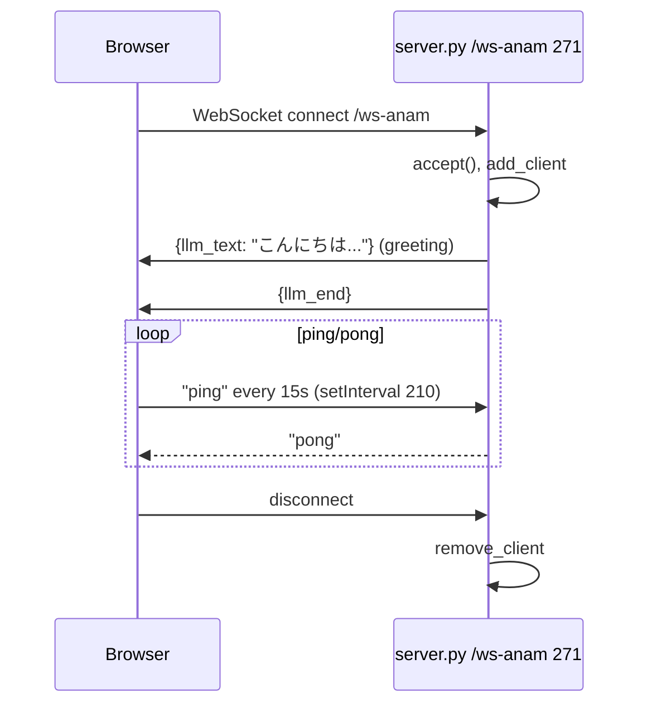

# Design Document: text-bridge-avatar

## Overview

**Purpose:** Bridge LLM text output to browser Anam avatar for TTS and lip-sync. The bridge connects `LLMTextBridgeProcessor`/`LLMTextForwarder` in `bot.py:54/96` and `WS /ws-anam` at `server.py:271` to frontend `createClient`/`handleLLMText` at `static/script.js:67/226`, decoupling server inference from cloud rendering.

**Users:** Browser Anam SDK (`createTalkMessageStream`) and `voice-pipeline-core` pipeline that emits `TextFrame`.

**Impact:** Adds `/ws-anam` handler and bridge processors; no DB. Greeting `こんにちは...` is hardcoded at `server.py:284`.

### Goals
- Fan-out `TextFrame`/`LLMFullResponseEndFrame` from pipeline to all `/ws-anam` browsers via `broadcast_text/end`
- Initialize Anam client with `disableInputAudio:true` and acquire `MediaStream` via `stream()`
- Stream LLM chunks via `createTalkMessageStream().streamMessageChunk` and `endMessage` with `isActive` guard
- Keepalive `ping` every 15s on browser, `pong` on server, with safe interval cleanup

### Non-Goals
- STT/VAD/LLM inference (→ `voice-pipeline-core`)
- Vonage audio relay (`/ws`, `serializer`) (→ `audio-connector-bridge`)
- Vonage token issuance or tunnel

## Boundary Commitments

### This Spec Owns
- `server.py:271` `WS /ws-anam` lifecycle (`add_client`/`remove_client`, greeting, `ping→pong`)
- `bot.py:54` `LLMTextBridgeProcessor` (fan-out, `set[WebSocket]`), `bot.py:96` `LLMTextForwarder` (frame capture + `push_frame`), singleton `_text_bridge` at `89`
- Frontend `static/script.js:67` `createClient`, `80` `stream()`, `226` `handleLLMText/handleLLMEnd/handleInterrupt`, `180` `wsAnam` `onmessage`/`onopen`/`onclose`/`onerror` and 15s `setInterval` at `210`

### Out of Boundary
- `Pipeline` order beyond `text_forwarder` insertion (owned by `voice-pipeline-core` but uses this spec's forwarder)
- Vonage dual publisher for `anamStream` (owned by `vonage-media-frontend` but consumes `anamStream` from here)
- `POST /api/anam/session-token` issuance (→ `session-provisioning`)

### Allowed Dependencies
- `voice-pipeline-core` for `TextFrame` supply and pipeline stage insertion
- `session-provisioning` for `anamToken` (via `POST /api/anam/session-token`)
- `vonage-media-frontend` for `anamStream` consumption (reverse dependency but allowed: this spec produces `anamStream`)
- `fastapi.WebSocket` (server) and `@anam-ai/js-sdk` (browser)

### Revalidation Triggers
- `WS /ws-anam` contract `{type: llm_text/llm_end}` shape change — breaks `static/script.js:188` dispatch and `LLMTextForwarder`
- `LLMTextBridgeProcessor` singleton change to per-connection — breaks fan-out sharing across `/ws` pipelines
- Anam SDK `createTalkMessageStream` signature change — breaks `handleLLMText`
- `disableInputAudio` flag change — introduces echo (Vonage vs Anam mic)

## Architecture

### Existing Architecture Analysis
*Pattern:* Fan-out Bridge (pipeline → WebSocket → SDK). Existing code leaks `setInterval` (never `clearInterval`), has dead `handleInterrupt`, and couples `LLMTextBridgeProcessor` to `fastapi.WebSocket`.
*Constraints:* Anam SDK is ESM via `esm.sh`; `ping` is plain text not JSON via `receive_text` at `291`.

### Architecture Pattern & Boundary Map

```mermaid
graph TB
  subgraph Server bot.py
    LLM[voice-pipeline-core LLM<br/>TextFrame]
    FWD[LLMTextForwarder<br/>96<br/>captures TextFrame]
    PROC[LLMTextBridgeProcessor<br/>54<br/>set[WebSocket] fan-out]
    SINGLE[_text_bridge singleton<br/>89]
  end
  subgraph Server server.py
    WSAnam[WS /ws-anam<br/>271<br/>add_client, greeting, ping→pong]
  end
  subgraph Browser static/script.js
    AnamInit[createClient<br/>67<br/>disableInputAudio]
    Stream[stream() → anamStream<br/>80-85]
    WSClient[wsAnam<br/>180<br/>onmessage dispatch]
    Talk[handleLLMText/handleLLMEnd<br/>226<br/>TalkMessageStream]
  end
  LLM --> FWD --> PROC --> SINGLE --> WSAnam --> WSClient --> Talk
  AnamInit --> Stream --> Talk
  WSAnam -.->|greeting こんにちは| WSClient
```

**Architecture Integration:**
- Pattern: Observer fan-out (bridge) + Streaming Adapter (Anam TTS).
- Boundaries: Pipeline owns text production; bridge owns WS fan-out; frontend owns SDK streaming; hidden coupling via singleton is documented as legacy (should be injected).
- Preserved: `TextFrame` → `broadcast_text` before `push_frame`, `LLMFullResponseEndFrame` → `broadcast_end`, `disableInputAudio:true`, `isActive` guard.
- Steering: `tech.md` System Components Map (Text WS Bridge/Anam Client) preserved.

### Technology Stack

| Layer | Choice / Version | Role in Feature | Notes |
|-------|------------------|-----------------|-------|
| Backend / Services | `fastapi.WebSocket` | `WS /ws-anam` | `receive_text`/`send_json` |
| Backend / Services | `bot.py` `LLMTextBridgeProcessor`, `LLMTextForwarder` | Fan-out and capture | `set[WebSocket]` |
| Frontend / CLI | `@anam-ai/js-sdk@latest` via `esm.sh` | Avatar TTS/lip-sync | `createClient`, `STREAM`, `TalkMessageStream` |
| Frontend / CLI | `WebSocket` browser | `wsAnam` | `wss/ws` auto per location.protocol |
| Data / Storage | In-memory singleton `_text_bridge` | Bridge state | Per process |

## File Structure Plan

### Directory Structure
```
bot.py                      # Modified: LLMTextBridgeProcessor 54, LLMTextForwarder 96, singleton 89
server.py                   # Modified: WS /ws-anam 271 with greeting 284 and ping→pong 292
static/script.js            # Modified: createClient 67, stream 80, wsAnam 180-214, handleLLMText 226
static/index.html           # No change; provides #anam-avatar sink (owned by frontend-shell)
```

### Modified Files
- `bot.py` — Add `LLMTextBridgeProcessor` (54) managing `set[WebSocket]`, `broadcast_text`/`broadcast_end` with discard, `LLMTextForwarder` (96) capturing frames and pushing. Singleton `_text_bridge` at `89` shared.
- `server.py` — Add `@app.websocket("/ws-anam")` (271): `accept`, `bridge.add_client`, greeting two `send_json`, `while True: receive_text ping→pong`, `finally: remove_client`.
- `static/script.js` — Add `createClient` (67) with `disableInputAudio:true`, `stream()` (80) to `anam-avatar`, `wsAnam` WebSocket (180) with `onmessage` dispatch `llm_text/llm_end`, `handleLLMText` (229) `createTalkMessageStream().streamMessageChunk`, `handleLLMEnd` (244) `isActive` guard, `handleInterrupt` (256) dead code, 15s `setInterval` (210).

## System Flows

```mermaid
sequenceDiagram
  participant LLM as voice-pipeline-core LLM
  participant FWD as LLMTextForwarder 96
  participant PROC as LLMTextBridgeProcessor 54
  participant WS as WS /ws-anam 271
  participant B as Browser wsAnam 180
  participant Anam as Anam SDK 67
  LLM->>FWD: TextFrame("こんにちは")
  FWD->>PROC: broadcast_text("こんにちは")
  PROC->>WS: send_json {type:llm_text, text} to all clients
  WS->>B: {llm_text}
  B->>Anam: if !currentTalkStream createTalkMessageStream()
  B->>Anam: streamMessageChunk("こんにちは", false)
  LLM->>FWD: LLMFullResponseEndFrame
  FWD->>PROC: broadcast_end()
  PROC->>WS: send_json {llm_end}
  WS->>B: {llm_end}
  B->>Anam: if isActive() endMessage(); currentTalkStream=null
```

*Decisions:* `broadcast_text` before `push_frame` ensures bridge receives even if downstream fails; `false` in `streamMessageChunk(text,false)` indicates non-final chunk (streaming, not append).



*Decisions:* Greeting hardcoded at `284` sent immediately per new client (not via LLM); `receive_text` expects plain `"ping"` not JSON — JSON `{"type":"ping"}` would be ignored (edge flagged). `setInterval` leak at `210` never `clearInterval` (bug flagged).

## Requirements Traceability

| Requirement | Summary | Components | Interfaces | Flows |
|-------------|---------|------------|------------|-------|
| 1.1-1.6 | WS management | `WsAnamEndpoint` | `WS /ws-anam`, `add_client/remove_client` | WS greeting flow |
| 2.1-2.6 | Fan-out | `BridgeProcessor`, `TextForwarder` | `broadcast_text/end`, `TextFrame` | Fan-out flow |
| 3.1-3.5 | Anam init | `AnamSdkInit` | `createClient`, `stream()` | Anam init |
| 4.1-4.6 | TTS streaming | `AnamTtsStreaming` | `TalkMessageStream` | TTS flow |
| 5.1-5.6 | Keepalive | `WsAnamClient` | `wsAnam` WebSocket | Ping/pong |
| 6.1-6.5 | Non-functional | `BridgeProcessor`, `WsAnamEndpoint` | — | — |

## Components and Interfaces

| Component | Domain/Layer | Intent | Req Coverage | Key Dependencies (P0/P1) | Contracts |
|-----------|--------------|--------|--------------|--------------------------|-----------|
| `WsAnamEndpoint` | Backend | Manage `/ws-anam` lifecycle and greeting | 1 | `BridgeProcessor` (P0) | API, Event |
| `BridgeProcessor` | Backend | Fan-out `TextFrame` to all `WebSocket` clients | 2, 6 | None | Service, State |
| `TextForwarder` | Backend | Capture `TextFrame`/`LLMFullResponseEndFrame` in pipeline | 2 | `BridgeProcessor` (P0) | Service |
| `AnamSdkInit` | Frontend | Init Anam client and acquire MediaStream | 3 | `WsAnamClient` (P1) | Service |
| `AnamTtsStreaming` | Frontend | Stream chunks to `TalkMessageStream` with guards | 4 | `AnamSdkInit` (P0) | Service |
| `WsAnamClient` | Frontend | Browser WebSocket for `llm_text`/`llm_end` | 5 | `WsAnamEndpoint` (P0) | API |

### Backend

#### WsAnamEndpoint

| Field | Detail |
|-------|--------|
| Intent | Accept `/ws-anam`, add to bridge, send greeting, handle `ping→pong`, remove on disconnect |
| Requirements | 1.1, 1.2, 1.3, 1.4, 1.5, 1.6, 6.1, 6.3 |
| Owner / Reviewers | — |

**Responsibilities & Constraints**
- `await websocket.accept()` then `bridge.add_client(websocket)` at `280`.
- Sends greeting `{"type":"llm_text","text":"こんにちは。私はAIアバターアシスタントです。何かお手伝いできますか？"}` then `{"type":"llm_end"}` at `284-285` via `send_json`.
- Handles `msg = await websocket.receive_text()`; if `msg=="ping"` responds `"pong"` at `292`; JSON `{"type":"ping"}` ignored (edge).
- `finally: bridge.remove_client(websocket)` at `297` and log `Browser disconnected`.

**Contracts**: Service [ ] / API [x] / Event [x] / Batch [ ] / State [ ]

##### API Contract
| Method | Endpoint | Request | Response | Errors |
|--------|----------|---------|----------|--------|
| WS | `/ws-anam` | `"ping"` text | `{"type":"llm_text","text": str}`, `{"type":"llm_end"}`, `"pong"` | 101; `Failed to send greeting` warning but keep alive |

##### Event Contract
- Published events: `llm_text`, `llm_end` (JSON) per `TextFrame` from pipeline.
- Subscribed events: `"ping"` text (plain, not JSON).
- Ordering: Greeting first per client, then pipeline-driven `llm_text` chunks, then `llm_end`.

#### BridgeProcessor

| Field | Detail |
|-------|--------|
| Intent | Fan-out text to `set[WebSocket]` with silent discard on disconnect |
| Requirements | 2.3, 2.4, 2.5, 2.6, 6.3 |
| Owner / Reviewers | — |

**Responsibilities & Constraints**
- `self._clients: set[WebSocket]` at `60`; `add_client`/`remove_client` at `62/65`.
- `broadcast_text(text)` loops all `ws`, `await ws.send_json({"type":"llm_text","text":text})`, collects failed into `disconnected` then `discard` at `68-76` — no logging (gap).
- `broadcast_end()` similarly at `78-86`.
- Singleton `_text_bridge` at `89` via `get_text_bridge()` — shared across pipelines (legacy).

**Contracts**: Service [x] / API [ ] / Event [ ] / Batch [ ] / State [x]

##### Service Interface
```python
class LLMTextBridgeProcessor:
  def add_client(self, ws: WebSocket): ...
  def remove_client(self, ws: WebSocket): ...
  async def broadcast_text(self, text: str): ...
  async def broadcast_end(self): ...
_text_bridge = LLMTextBridgeProcessor()
def get_text_bridge() -> LLMTextBridgeProcessor: ...
```
- Preconditions: `ws` is accepted WebSocket.
- Postconditions: `broadcast` removes failed `ws` silently.
- Invariants: `set` may contain multiple browsers (multi-tab fan-out).

**Implementation Notes**
- Validation: Two browsers connected → both receive same greeting and same `TextFrame` chunks; disconnect one → other still receives.
- Risks: Coupling to `fastapi.WebSocket` (should be `Protocol` with `send_json`); silent discard hides issues.

#### TextForwarder

| Field | Detail |
|-------|--------|
| Intent | Capture `TextFrame`/`LLMFullResponseEndFrame` in Pipecat pipeline and delegate to bridge |
| Requirements | 2.1, 2.2 |
| Owner / Reviewers | — |

**Responsibilities & Constraints**
- `async def process_frame(self, frame, direction)` at `103`: `await super().process_frame`; if `isinstance(frame, TextFrame)` then `await bridge.broadcast_text(frame.text)` at `106`; if `LLMFullResponseEndFrame` then `broadcast_end` at `108`; then `await push_frame(frame, direction)` at `109`.
- Must be after `assistant_aggregator` in pipeline (owned by `voice-pipeline-core`).

**Contracts**: Service [x] / API [ ] / Event [ ] / Batch [ ] / State [ ]

### Frontend

#### AnamSdkInit

| Field | Detail |
|-------|--------|
| Intent | Initialize Anam client and MediaStream for rendering and Vonage publish |
| Requirements | 3.1-3.5 |
| Owner / Reviewers | — |

**Responsibilities & Constraints**
- `createClient(anamToken, {disableInputAudio:true})` at `67` — `disableInputAudio:true` prevents echo (Vonage mic already captured).
- Listeners `AnamEvent.SESSION_READY` → log `Anam avatar ready`, `CONNECTION_CLOSED` → log `Anam connection closed` at `71-75`.
- `await anamClient.stream()` → `streams[0]` → `anamVideo.srcObject` → `play()` at `80-85`; `play()` rejection caught at `87` (autoplay block).

**Contracts**: Service [x] / API [ ] / Event [x] / Batch [ ] / State [ ]

#### AnamTtsStreaming

| Field | Detail |
|-------|--------|
| Intent | Stream `llm_text` chunks to `TalkMessageStream` with lazy creation and guards |
| Requirements | 4.1-4.6, 6.1 |
| Owner / Reviewers | — |

**Responsibilities & Constraints**
- `let currentTalkStream = null` at `227`; `handleLLMText(text)` at `229`: if `!anamClient` → `log('LLM: {text}')` fallback; else if `!currentTalkStream` → `createTalkMessageStream()` then `streamMessageChunk(text, false)` at `236-238`.
- `handleLLMEnd()` at `244`: if `currentTalkStream && isActive()` → `endMessage()` then `null` at `247-253`.
- `handleInterrupt()` at `256`: `endMessage()` then `interruptPersona()` — dead code (never called, flagged).
- Empty `anamStream` tracks at `155` → skip avatar publish (edge at `153` in other spec).

**Contracts**: Service [x] / API [ ] / Event [ ] / Batch [ ] / State [x]

##### State Management
- State model: `currentTalkStream: TalkMessageStream | null` plus `anamClient`/`anamStream`.
- Persistence: In-memory per tab.
- Concurrency: Single `TalkMessageStream` per utterance; multiple `llm_text` chunks reuse same stream until `llm_end`.

#### WsAnamClient

| Field | Detail |
|-------|--------|
| Intent | Browser WebSocket to receive `llm_text`/`llm_end` and keepalive |
| Requirements | 5.1-5.6, 6.1 |
| Owner / Reviewers | — |

**Responsibilities & Constraints**
- `wsProto = location.protocol==='https:' ? 'wss:' : 'ws:'` at `181` then `new WebSocket(`${wsProto}//${host}/ws-anam`)` at `182`.
- `onopen` → log `Anam WS connected` (184); `onmessage` at `188` JSON parse then dispatch `handleLLMText`/`handleLLMEnd`; `onclose` → log disconnected (201); `onerror` → log error (205).
- `setInterval(() => { if (OPEN) wsAnam.send('ping') }, 15000)` at `210` — never `clearInterval` (leak flagged).
- `disconnect()` should close `wsAnam` and clear interval (gap in `connection-lifecycle`).

**Contracts**: Service [ ] / API [x] / Event [x] / Batch [ ] / State [ ]

## Data Models

### Domain Model
No persisted domain; `LLMTextBridgeProcessor._clients` is transient per process; `TalkMessageStream` is Anam SDK session-bound; `anamStream` is `MediaStream` with `MediaStreamTrack`s.

### Logical Data Model
**Structure Definition:**
- `WsAnamMessage` = `{"type": "llm_text", "text": string} | {"type": "llm_end"}` (server → browser, JSON).
- `PingPong` = `"ping"` (browser→server text) / `"pong"` (server→browser text) — not JSON.
- `AnamPersonaConfig` already handled in `session-provisioning`; this spec only uses `sessionToken`.

### Data Contracts & Integration

**API Data Transfer**
- `WS /ws-anam` server→client: JSON `llm_text`/`llm_end`; client→server: text `ping`.
- Anam SDK: `createTalkMessageStream(): TalkMessageStream`, `streamMessageChunk(chunk: string, isFinal: boolean)`, `isActive(): boolean`, `endMessage(): void`, `interruptPersona(): void`.

**Cross-Service Data Management**
- Fan-out is eventual consistent (each `ws` independent; slow client may lag).

## Error Handling

### Error Strategy
- Greeting send exception → log warning, keep connection.
- `broadcast_text` `ws` send exception → discard `ws` silently (gap: should log count).
- `createClient`/`stream()` failure → log `Anam initialization error` and degrade to audio-only (text still logged via `LLM:` fallback).
- `streamMessageChunk`/`endMessage` failure → log `Anam stream error`, keep `currentTalkStream` for retry.

### Error Categories and Responses
**User Errors (4xx):** Not applicable (WS).
**System Errors (5xx):** Anam SDK throws → logged not 5xx; `broadcast` silent discard.
**Business Logic Errors (422):** None.

### Monitoring
- Logs: `Browser connected to /ws-anam`, `Failed to send greeting`, `Anam avatar ready`, `Anam WS connected/disconnected`.
- Metrics: No metrics; future count fan-out clients.

## Testing Strategy

- **Unit Tests:** `LLMTextBridgeProcessor` add/remove/broadcast with mock `WebSocket` success/failure → verify discard; `LLMTextForwarder` captures `TextFrame` then `broadcast_text` then `push_frame`; `handleLLMText` creates stream lazily, reuses, respects `isActive` on `handleLLMEnd`.
- **Integration Tests:** `TestClient` WebSocket `/ws-anam` → expects greeting `llm_text`+`llm_end`; send `ping` → `pong`; pipeline `TextFrame("hi")` → both browsers receive `llm_text`.
- **E2E/UI Tests:** Browser `connect` → Anam avatar appears, speak → `llm_text` chunks appear in log fallback if `anamClient` missing.
- **Performance/Load:** Fan-out to 5 tabs → all receive same chunks within 100ms; measure `broadcast_text` loop overhead.

## Security Considerations
- `anamToken` only in memory `let anamToken` (35), not `localStorage`/URL — enforced.
- `d.textContent` for log at `static/script.js:21` prevents XSS; `innerHTML` must never be used.
- `disableInputAudio:true` privacy (no mic to Anam).

## Performance & Scalability
- Fan-out loop is `O(n)` per `TextFrame` (`n` browsers); `set[WebSocket]` iteration is cheap for <10 clients (demo).
- 15s `ping` vs server `ping→pong` is low overhead; `setInterval` leak flagged for fix (`clearInterval`).

## Supporting References
- Anam JS SDK: `https://docs.anam.ai/js-sdk` (`createClient`, `TalkMessageStream`) — pointer to `research.md`.
