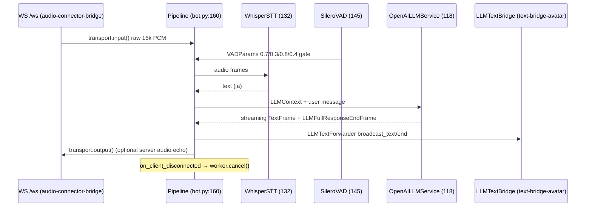
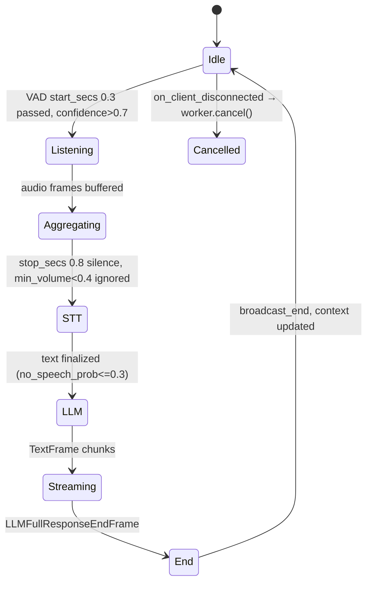

# Design Document: voice-pipeline-core

## Overview

**Purpose:** Provide the Pipecat voice pipeline that transforms microphone audio into LLM text. The core assembles `SileroVADAnalyzer` at `bot.py:145`, `WhisperSTTServiceMLX` at `132`, `OpenAILLMService` at `118`, `LLMContextAggregatorPair` at `142`, and `Pipeline`/`PipelineWorker`/`WorkerRunner` at `160`/`172` into a 7-stage pipeline, with a monkey-patch at `34` to forward LLM text downstream to `text-bridge-avatar`.

**Users:** `audio-connector-bridge` (`/ws` transport) invokes `bot()` per WebSocket; `text-bridge-avatar` consumes `TextFrame` via `LLMTextForwarder`.

**Impact:** Adds `bot.py` pipeline logic; no new endpoints. Relies on LM Studio at `http://localhost:1234/v1` and Apple Silicon `mlx-whisper`.

### Goals
- Achieve Japanese STT with `LARGE_V3_TURBO_Q4` and `no_speech_prob=0.3` filtering
- Gate LLM submission with Silero VAD (`0.7`/`0.3`/`0.8`/`0.4`) and `audio_idle_timeout=2.0`/`user_turn_stop_timeout=5.0`
- Generate 2-3 sentence Japanese responses via LM Studio with streaming `TextFrame`/`LLMFullResponseEndFrame`
- Execute via `PipelineWorker` with metrics enabled and propagate worker cancel on disconnect

### Non-Goals
- Vonage WebSocket termination (→ `audio-connector-bridge`)
- Text fan-out or Anam rendering (→ `text-bridge-avatar`)
- Vonage/Anam token issuance or tunnel

## Boundary Commitments

### This Spec Owns
- All Pipecat service creation: `WhisperSTTServiceMLX`, `SileroVADAnalyzer`/`VADParams`, `OpenAILLMService`, `LLMContext`/`AggregatorPair`, `Pipeline`/`PipelineParams`/`PipelineWorker`/`WorkerRunner` at `bot.py:112-192`
- Monkey-patch `_forwarding_handle_text/_forwarding_handle_llm_end` at `34-45` that forces `push_frame(DOWNSTREAM)`
- Constants `AUDIO_OUT_SAMPLE_RATE=16000` at `47` and env defaults `LM_STUDIO_BASE_URL`, `LM_MODEL`, `STT_LANGUAGE` at `49-51`
- `transport` event handlers `on_client_connected/disconnected` at `182-189`

### Out of Boundary
- `FastAPIWebsocketTransport` creation (owned by `audio-connector-bridge`); this spec receives `transport` as argument
- `LLMTextBridgeProcessor`/`LLMTextForwarder` broadcast logic beyond pipeline insertion (owned by `text-bridge-avatar` but instantiated here)
- `POST /api/*` or static serving

### Allowed Dependencies
- `pipecat-ai[mlx-whisper,openai,silero,websocket]` (`SileroVADAnalyzer`, `WhisperSTTServiceMLX`, `OpenAILLMService`, `Pipeline` etc.)
- `text-bridge-avatar` `LLMTextBridgeProcessor` (injected as `text_bridge` singleton at `89`) and `LLMTextForwarder` (pipeline stage)
- No direct Vonage SDK dependency (transport abstracts)

### Revalidation Triggers
- `Pipeline` order change (e.g., moving `text_forwarder` before `assistant_aggregator`) — breaks monkey-patch downstream forwarding
- `VADParams` tuning change (`confidence` etc.) — affects turn-taking latency/accuracy
- `OpenAILLMService.system_instruction` rewrite — changes response language/length contract
- `AUDIO_OUT_SAMPLE_RATE` change from 16000 — breaks Vonage serializer alignment

## Architecture

### Existing Architecture Analysis
*Pattern:* Pipecat Pipeline with `PipelineWorker`/`WorkerRunner`. Existing `bot.py` duplicates `load_dotenv` and re-reads `VONAGE_AUDIO_RATE` instead of injection; `_messages.clear()` uses private API.
*Constraints:* Must run on Apple Silicon for `mlx-whisper`; LM Studio must be at `localhost:1234` with model loaded.

### Architecture Pattern & Boundary Map

```mermaid
graph LR
  subgraph Pipeline bot.py:160
    In[transport.input()]
    STT[WhisperSTTServiceMLX<br/>132]
    UA[User Aggregator<br/>Silero VAD 145]
    LLM[OpenAILLMService<br/>118]
    AA[Assistant Aggregator]
    TF[LLMTextForwarder<br/>96]
    Out[transport.output()]
    In --> STT --> UA --> LLM --> AA --> TF --> Out
  end
  MP[Monkey-patch<br/>34-45<br/>push DOWNSTREAM] -.-> AA
  VAD[SileroVADAnalyzer<br/>0.7/0.3/0.8/0.4] --> UA
  Ctx[LLMContext<br/>140-142] --> UA & AA
  In & Out -.->|injected| Transport[FastAPIWebsocketTransport<br/>from audio-connector-bridge]
  TF -->|TextFrame| Bridge[LLMTextBridgeProcessor<br/>text-bridge-avatar]
```

**Architecture Integration:**
- Pattern: Linear Pipeline (Pipecat) with aggregation pair for context-aware turn management.
- Boundaries: This spec owns pipeline stages; `audio-connector-bridge` owns transport; `text-bridge-avatar` owns bridge singleton.
- Preserved: 7-stage order, `PipelineParams(audio_in/out 16000, metrics)`, `WorkerRunner(handle_sigint)`.
- Steering: `tech.md` System Components Map (Pipeline Services/Voice Pipeline) preserved; `product.md` Architecture Overview (Pipecat Pipeline) unchanged.

### Technology Stack

| Layer | Choice / Version | Role in Feature | Notes |
|-------|------------------|-----------------|-------|
| Backend / Services | `pipecat-ai>=1.4.0` `WhisperSTTServiceMLX` `MLXModel.LARGE_V3_TURBO_Q4` | STT Japanese (ja) | `no_speech_prob=0.3` |
| Backend / Services | `silero` `SileroVADAnalyzer` `VADParams` | VAD gating | `0.7/0.3/0.8/0.4` + `idle2.0/stop5.0` |
| Backend / Services | `OpenAILLMService` | LLM streaming | `base_url` LM Studio `http://localhost:1234/v1` |
| Backend / Services | `LLMContext`, `LLMContextAggregatorPair`, `Pipeline`, `PipelineWorker`, `WorkerRunner` | Context/pipeline orchestration | 7 stages |
| Data / Storage | In-memory `LLMContext._messages` | Conversation history | Per `/ws` connection, no persistence |

## File Structure Plan

### Directory Structure
```
bot.py                      # Single file owning entire pipeline; no submodules (demo scope)
├── LLMTextBridgeProcessor (54) + LLMTextForwarder (96) definitions — shared with text-bridge-avatar
├── run_bot(transport, handle_sigint, sample_rate, text_bridge) (112) — pipeline assembly
└── bot(runner_args, transport) (196) — thin wrapper re-reading VONAGE_AUDIO_RATE
```

### Modified Files
- `bot.py` — Create `LLMTextBridgeProcessor` (54) and `LLMTextForwarder` (96) (shared), monkey-patch block (34-45), constants (47-51), `run_bot` (112) with workers, `bot` (196). Each class has single responsibility; pipeline order is the critical contract.

## System Flows



*Decisions:* `text_forwarder` after `assistant_aggregator` is required because monkey-patch pushes `TextFrame` downstream from `assistant_aggregator`; without patch, `transport.output` would not receive LLM text for audio, but bridge would still via `LLMTextForwarder`.



## Requirements Traceability

| Requirement | Summary | Components | Interfaces | Flows |
|-------------|---------|------------|------------|-------|
| 1.1-1.5 | STT | `STTService` | `WhisperSTTServiceMLX` | STT flow |
| 2.1-2.4 | VAD | `VADService` | `SileroVADAnalyzer`, `LLMUserAggregatorParams` | VAD state |
| 3.1-3.5 | LLM | `LLMService` | `OpenAILLMService` | LLM streaming |
| 4.1-4.5 | Context | `ContextAggregation` | `LLMContext`, `AggregatorPair` | Context flow |
| 5.1-5.5 | Pipeline/worker/runner | `PipelineAssembly`, `Execution` | `Pipeline`, `PipelineWorker`, `WorkerRunner` | Pipeline seq |
| 6.1-6.4 | Monkey-patch | `MonkeyPatch` | `LLMAssistantAggregator._handle_*` | — |
| 7.1-7.6 | Non-functional | `Execution` | `AUDIO_OUT_SAMPLE_RATE`, load_dotenv | — |

## Components and Interfaces

| Component | Domain/Layer | Intent | Req Coverage | Key Dependencies (P0/P1) | Contracts |
|-----------|--------------|--------|--------------|--------------------------|-----------|
| `STTService` | Pipeline | Transcribe 16k PCM to Japanese text | 1 | `VADService` (P1) | Service |
| `VADService` | Pipeline | Gate speech segments for turn control | 2 | None | Service |
| `LLMService` | Pipeline | Generate 2-3 sentence Japanese responses via LM Studio | 3 | `STTService` (P0) | Service |
| `ContextAggregation` | Pipeline | Maintain `LLMContext` history via aggregator pair | 4 | `LLMService` (P0) | State |
| `PipelineAssembly` | Pipeline | Assemble 7-stage pipeline in strict order | 5.1 | All above (P0) | Service |
| `Execution` | Pipeline | Run via `WorkerRunner` with metrics and disconnect handling | 5.2-5.5, 7 | `PipelineAssembly` (P0), `audio-connector-bridge` transport (P0) | Service |
| `MonkeyPatch` | Pipeline | Force `LLMAssistantAggregator` to push downstream | 6 | `PipelineAssembly` (P0) | Service |

### Pipeline Layer

#### STTService

| Field | Detail |
|-------|--------|
| Intent | Apple Silicon accelerated STT with silence filtering |
| Requirements | 1.1, 1.2, 1.3, 1.4, 1.5 |
| Owner / Reviewers | — |

**Responsibilities & Constraints**
- Creates `WhisperSTTServiceMLX(Settings(model=LARGE_V3_TURBO_Q4, language=Language(ja), no_speech_prob=0.3))` at `132`.
- `STT_LANGUAGE` defaults to `ja` at `51`; fixed model `LARGE_V3_TURBO_Q4` for memory tradeoff (24GB+)).
- Requires 16000 Hz input; relies on upstream `VonageFrameSerializer` resampling.

**Contracts**: Service [x] / API [ ] / Event [ ] / Batch [ ] / State [ ]

#### VADService

| Field | Detail |
|-------|--------|
| Intent | Detect speech segments to control LLM submission timing |
| Requirements | 2.1, 2.2, 2.3, 2.4 |
| Owner / Reviewers | — |

**Responsibilities & Constraints**
- `SileroVADAnalyzer(VADParams(confidence=0.7, start_secs=0.3, stop_secs=0.8, min_volume=0.4))` at `145`.
- `LLMUserAggregatorParams(audio_idle_timeout=2.0, user_turn_stop_timeout=5.0)` at `153` — idle flush and max turn.

**Contracts**: Service [x] / API [ ] / Event [ ] / Batch [ ] / State [ ]

#### LLMService

| Field | Detail |
|-------|--------|
| Intent | Stream Japanese responses via LM Studio OpenAI-compatible API |
| Requirements | 3.1, 3.2, 3.3, 3.4, 3.5 |
| Owner / Reviewers | — |

**Responsibilities & Constraints**
- `OpenAILLMService(base_url=LM_STUDIO_BASE_URL or "http://localhost:1234/v1", api_key="not-needed", model=LM_MODEL, system_instruction="You are a helpful...")` at `118`.
- Emits `TextFrame` chunks then `LLMFullResponseEndFrame` — each chunk is partial, not full sentence; empty `LM_MODEL` delegates to LM Studio default.

**Contracts**: Service [x] / API [ ] / Event [ ] / Batch [ ] / State [ ]

##### Service Interface
```python
llm = OpenAILLMService(
  base_url: str = "http://localhost:1234/v1",
  api_key: str = "not-needed",
  settings=Settings(model: str, system_instruction: str)
)
```
- Preconditions: LM Studio reachable at `base_url`; model loaded.
- Postconditions: Stream `TextFrame` → `LLMFullResponseEndFrame`.
- Invariants: `system_instruction` fixed to 2-3 sentence Japanese, no markdown.

#### ContextAggregation

| Field | Detail |
|-------|--------|
| Intent | Separate user/assistant turns while preserving history |
| Requirements | 4.1-4.5 |
| Owner / Reviewers | — |

**Responsibilities & Constraints**
- `LLMContext()` then `_messages.clear()` at `140-141` (private API, flagged).
- `LLMContextAggregatorPair(context, user_params)` creates pair at `142`.
- Per `/ws` connection; lost on `worker.cancel` (no persistence).

**Contracts**: Service [ ] / API [ ] / Event [ ] / Batch [ ] / State [x]

##### State Management
- State model: `LLMContext._messages: list[Message]` in-memory.
- Persistence: None; per-pipeline.
- Concurrency: One context per `run_bot` invocation; not shared.

#### PipelineAssembly

| Field | Detail |
|-------|--------|
| Intent | Order pipeline stages strictly |
| Requirements | 5.1, 6.1, 6.2 |
| Owner / Reviewers | — |

**Responsibilities & Constraints**
- `Pipeline([transport.input(), stt, user_aggregator, llm, assistant_aggregator, text_forwarder, transport.output()])` at `160` — `text_forwarder` must be after `assistant_aggregator`.
- Monkey-patch at `34-45` must be loaded before pipeline creation.

**Contracts**: Service [x] / API [ ] / Event [ ] / Batch [ ] / State [ ]

#### Execution

| Field | Detail |
|-------|--------|
| Intent | Run pipeline with metrics and handle client lifecycle |
| Requirements | 5.2, 5.3, 5.4, 5.5, 7.1-7.6 |
| Owner / Reviewers | — |

**Responsibilities & Constraints**
- `PipelineWorker(pipeline, PipelineParams(audio_in_sample_rate=sample_rate, audio_out_sample_rate=16000, enable_metrics=True, enable_usage_metrics=True))` at `172`.
- `transport.event_handler("on_client_connected")` logs `Client connected`; `on_client_disconnected` logs `Client disconnected` then `await worker.cancel()` at `182-189`.
- `WorkerRunner(handle_sigint)` at `191` with `handle_sigint` from `WebSocketRunnerArguments` at `261` in server.
- Duplicate env read at `200` `int(os.getenv("VONAGE_AUDIO_RATE","16000"))` — should be injected (legacy).

**Contracts**: Service [x] / API [ ] / Event [x] / Batch [ ] / State [ ]

##### Event Contract
- Subscribed events: `on_client_connected`, `on_client_disconnected` from transport.
- Ordering: `cancel()` after `disconnected` ensures pipeline stops before `transport.cleanup()`.

## Data Models

### Domain Model
No persisted domain; `LLMContext` is transient aggregate per connection; `TextFrame`/`LLMFullResponseEndFrame` are pipeline events; `AudioRawFrame` is 16k PCM.

### Logical Data Model
**Structure Definition:**
- `LLMContext._messages: list[{role: "user"|"assistant", content: str}]` — cleared at start.
- `VADParams{confidence: float, start_secs: float, stop_secs: float, min_volume: float}`.
- `LLMUserAggregatorParams{vad_analyzer, audio_idle_timeout: 2.0, user_turn_stop_timeout: 5.0}`.

**Consistency & Integrity:**
- `audio_in_sample_rate` (from `sample_rate` arg) must equal `VonageFrameSerializer` rate (16000) — otherwise STT distortion.
- `AUDIO_OUT_SAMPLE_RATE` 16000 must equal Vonage output expectation.

### Data Contracts & Integration

**API Data Transfer**
- `OpenAILLMService` → LM Studio `POST /v1/chat/completions` (OpenAI spec) with `model` and `messages`.

**Cross-Service Data Management**
- No distributed transactions; LM Studio is stateless.

## Error Handling

### Error Strategy
- STT/VAD/LLM exception → propagate to `PipelineWorker` → `WorkerRunner` → `transport.cleanup()` → `/ws` keepalive break.
- `sample_rate` parse failure → 500 before pipeline start.
- LM Studio unreachable → Pipecat default retry, no fallback model.

### Error Categories and Responses
**User Errors (4xx):** None.
**System Errors (5xx):** STT `no_speech_prob` discard (not error); LLM unreachable → exception; VAD noise below `confidence` → not speech (not error).
**Business Logic Errors (422):** None.

### Monitoring
- Logs: `Starting bot with sample rate: {rate}` at `201`; `Client connected/disconnected` at `184/188`.
- Metrics: `enable_metrics`/`enable_usage_metrics` always True for future `ops-deployment` scraping.

## Testing Strategy

- **Unit Tests:** `WhisperSTTServiceMLX` creation with `LARGE_V3_TURBO_Q4` and `ja`; `SileroVADAnalyzer` params 0.7/0.3/0.8/0.4; `OpenAILLMService` system_instruction check; `Pipeline` order 7 stages; `PipelineParams` 16000/True.
- **Integration Tests:** Mock `transport` → `run_bot` → verify `LLMContext` starts empty; mock LM Studio streaming → verify `TextFrame` chunks and `LLMFullResponseEndFrame` emitted; verify `LLMTextForwarder` receives via monkey-patch.
- **E2E/UI Tests:** Real `/ws` → speak Japanese → verify STT text in logs and LLM 2-3 sentence response in `llm_text` bridge.
- **Performance/Load:** `mlx_whisper` memory < 8GB with `Q4`; concurrent pipelines not expected (1 per `/ws`).

## Security Considerations
- `api_key="not-needed"` not logged; `base_url` may be logged but not key.
- No auth on pipeline; relies on `/ws` token (Vonage).
- `load_dotenv(override=True)` duplication flagged.

## Performance & Scalability
- `LARGE_V3_TURBO_Q4` chosen for 24GB+ Mac; `Q4` quant reduces memory vs `LARGE_V3`.
- 20ms output chunks (`audio_out_10ms_chunks=2` in transport) not pipeline but affects STT latency.
- Single pipeline per `/ws`; no horizontal scaling in demo.

## Supporting References
- Pipecat VAD tuning: `https://docs.pipecat.ai/guides/vad` (for `confidence` etc.) → `research.md`.
