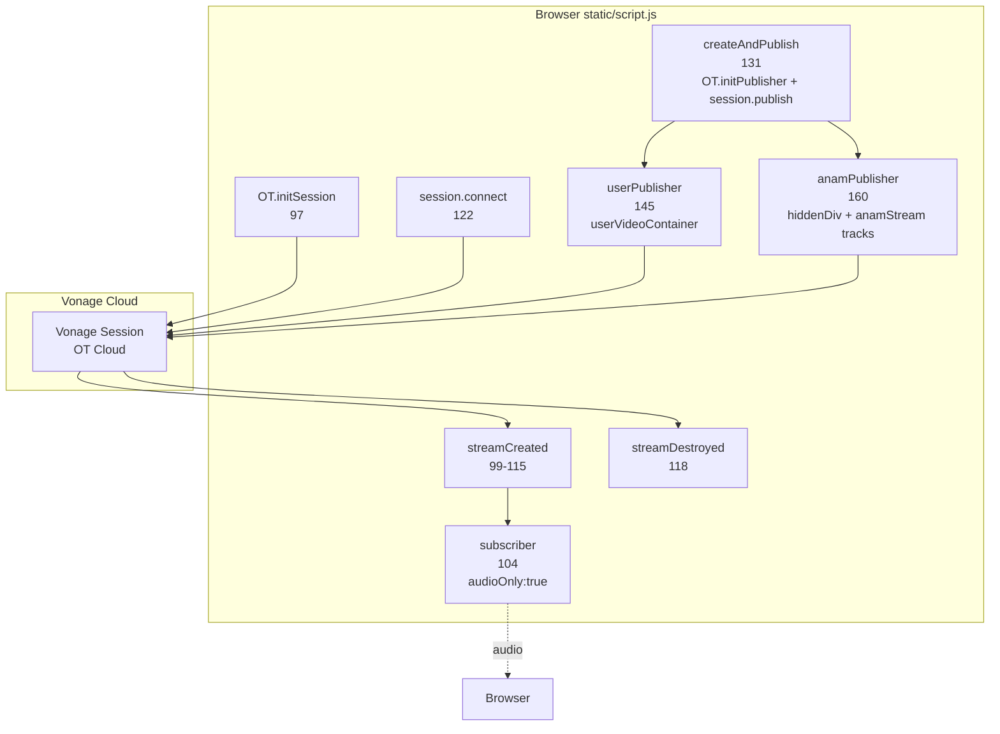
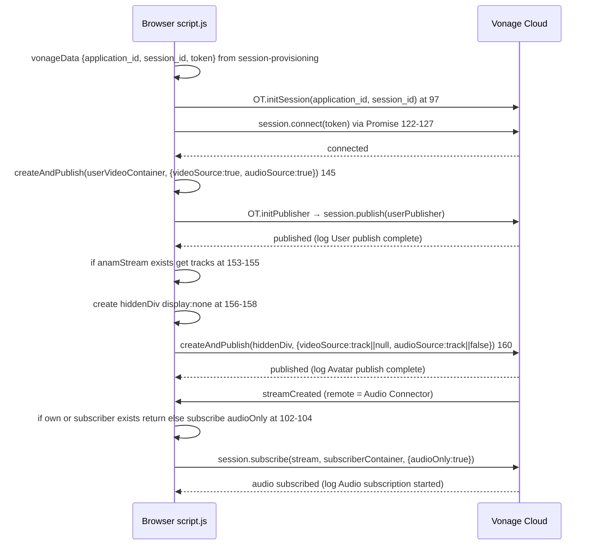
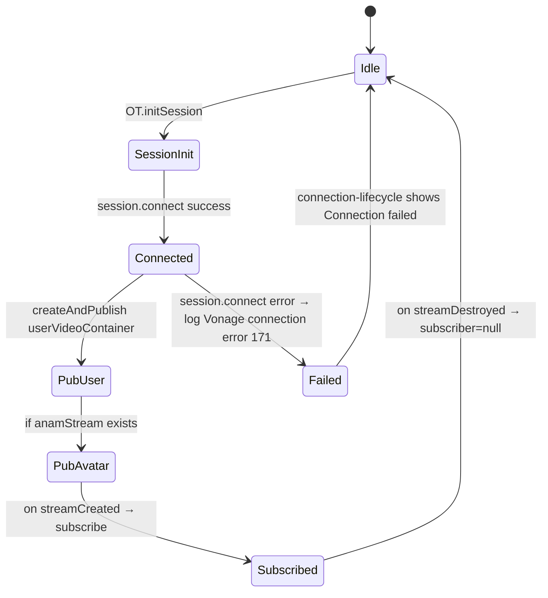

# Design Document: vonage-media-frontend

## Overview

**Purpose:** Control browser-side Vonage Video media: establish `OT.initSession`/`session.connect` at `static/script.js:97`, provide `createAndPublish` helper at `131` for dual publishers (user cam+mic to `userVideoContainer` and Anam MediaStream to hidden div), and subscribe via `session.subscribe` at `104` (`audioOnly:true`) within a single Vonage session identified by `session-provisioning` tokens.

**Users:** Browser user who has obtained `vonageData{application_id, session_id, token}` from `POST /api/vonage/session`; operator verifying dual publish.

**Impact:** Expands `static/script.js` media layer; no new endpoints. Relies on `frontend-shell` DOM sinks and `text-bridge-avatar` `anamStream`.

### Goals
- Connect to Vonage session with publisher token and exclude self in `streamCreated`
- Publish user webcam+mic and avatar MediaStream via promise-wrapped `OT.initPublisher`+`session.publish`
- Subscribe to Audio Connector audio (`audioOnly:true`) with single-subscriber guard
- Handle permission denial and publish failures with degradation (continue to next step)

### Non-Goals
- Anam SDK init/TTS (→ `text-bridge-avatar`)
- `POST /api/*` or `/ws` handling
- 5-step orchestration state (→ `connection-lifecycle`); this spec only provides media primitives

## Boundary Commitments

### This Spec Owns
- `session` lifecycle (`OT.initSession`, `session.connect`, `session.on('streamCreated'/'streamDestroyed')`, `session.subscribe` at `97-122`)
- `createAndPublish(container, opts)` helper at `131` and dual publish invocations at `145` (user) and `160` (avatar to hidden div `156`)
- `userPublisher`, `anamPublisher`, `subscriber`, `session` variables at `11-14` (partial ownership shared with `connection-lifecycle` for `disconnect` unpublish)

### Out of Boundary
- `anamStream` acquisition (`text-bridge-avatar` owns `createClient.stream()`)
- `wsAnam` and `handleLLMText` (→ `text-bridge-avatar`)
- `isConnected`/`connectBtn`/`status` state (→ `connection-lifecycle`; this spec only logs `Vonage connection error` at `171` as duplicated responsibility flagged)

### Allowed Dependencies
- Vonage `opentok.min.js` (`OT`) global loaded before `script.js` (via `frontend-shell` `index.html:7`)
- `frontend-shell` DOM sinks (`userVideoContainer`, `anam-avatar` hidden div parent, `subscriberContainer`)
- `text-bridge-avatar` `anamStream` (`MediaStream` with `getVideoTracks`/`getAudioTracks`)
- `session-provisioning` `vonageData` tokens (read-only)

### Revalidation Triggers
- `createAndPublish` signature change ( `OT.initPublisher(container, opts, cb)` callback shape) — breaks publisher creation
- `OT.initSession(application_id, session_id)` param order change — breaks session init
- `audioOnly:true`/`enableAudio:true` rename — breaks subscriber
- Hidden div publishing mechanism change (e.g., `display:none` → off-screen) — breaks avatar publish

## Architecture

### Existing Architecture Analysis
*Pattern:* Browser Vonage SDK imperative: `OT.initSession` → `session.connect` → `OT.initPublisher` → `session.publish` → `session.subscribe`. Existing code defines `createAndPublish` inside `connect()` closure (reallocation per connect) and uses `hiddenDiv.style.display='none'` which may be throttled.
*Constraints:* Must publish `userPublisher` to visible `userVideoContainer` and `anamPublisher` to hidden sink for recording; `subscriberContainer` is `display:none` (audio-only).

### Architecture Pattern & Boundary Map



**Architecture Integration:**
- Pattern: Dual Publisher (one visible, one hidden for recording) + Single Subscriber guard.
- Boundaries: This spec owns OT lifecycle; `text-bridge-avatar` owns `anamStream` source; `connection-lifecycle` owns orchestration order.
- Preserved: Promise-wrapped `OT.initPublisher`+`publish`, self-exclusion `connectionId === session.connection.connectionId`, `if (subscriber) return` guard, `audioOnly:true`.
- Steering: `tech.md` System Components Map (Browser Vonage Media) preserved; `product.md` Architecture Overview (unified video session) unchanged.

### Technology Stack

| Layer | Choice / Version | Role in Feature | Notes |
|-------|------------------|-----------------|-------|
| Frontend / CLI | `opentok.min.js` `v2` | Vonage session/publisher/subscriber | `OT.initSession`, `OT.initPublisher`, `session.publish/subscribe` |
| Frontend / CLI | Browser `MediaStream`, `MediaStreamTrack` | Avatar stream tracks | `getVideoTracks/getAudioTracks` |
| Data / Storage | In-memory `session`, `userPublisher`, `anamPublisher`, `subscriber` | Media state | `let` globals at `11-14` |
| Infrastructure / Runtime | Single Vonage session per `connect()` | Multiplex user+avatar | Global singleton |

## File Structure Plan

### Directory Structure
```
static/
├── index.html          # Provides DOM sinks (frontend-shell)
└── script.js           # Modified: Vonage media section 11-14, 97-169
```

### Modified Files
- `static/script.js` — Add `let session, anamPublisher, userPublisher, subscriber` at `11-14`, `OT.initSession`/`session.on`/`session.connect` at `97-128`, `createAndPublish` at `131`, dual publish at `145` and `156-164`. Single responsibility: manage Vonage media; no Anam TTS or WS handling.
- `static/index.html` — No change; provides `userVideoContainer` at `41`, `anam-avatar` at `46`, `subscriberContainer` hidden at `50` (owned by frontend-shell).

## System Flows



*Decisions:* `hiddenDiv` is appended to `document.body` then used as publisher container; `videoSource:null` creates audio-only publisher when no video track exists. `audioSource:false` disables audio if no track.



## Requirements Traceability

| Requirement | Summary | Components | Interfaces | Flows |
|-------------|---------|------------|------------|-------|
| 1.1-1.6 | Session connection | `VonageSession` | `OT.initSession`, `session.connect`, `streamCreated/Destroyed`, `subscribe` | Connection flow |
| 2.1-2.6 | Dual publishers | `Publisher` | `OT.initPublisher`, `session.publish`, `createAndPublish` | Dual publish flow |
| 3.1-3.3 | Subscriber | `Subscriber` | `session.subscribe audioOnly` | Subscribe |
| 4.1-4.5 | Error/degradation | `Publisher`, `VonageSession` | `OT` error callbacks | — |
| 5.1-5.6 | Security etc | `Publisher`, `Lifecycle` | `session.unpublish` | — |

## Components and Interfaces

| Component | Domain/Layer | Intent | Req Coverage | Key Dependencies (P0/P1) | Contracts |
|-----------|--------------|--------|--------------|--------------------------|-----------|
| `VonageSession` | Frontend | Manage OT session connect and stream events | 1 | Vonage SDK (P0), `frontend-shell` DOM (P1) | Service, Event |
| `Publisher` | Frontend | Dual publish user and avatar via promise wrapper | 2, 4 | `VonageSession` (P0), `text-bridge-avatar` anamStream (P0) | Service |
| `Subscriber` | Frontend | Subscribe audioOnly with guard | 3 | `VonageSession` (P0) | Service |

### Frontend

#### VonageSession

| Field | Detail |
|-------|--------|
| Intent | Establish session and handle stream lifecycle |
| Requirements | 1.1, 1.2, 1.3, 1.4, 1.5, 1.6, 4.3 |
| Owner / Reviewers | — |

**Responsibilities & Constraints**
- `OT.initSession(application_id, session_id)` at `97` before any `session.on`.
- `session.on('streamCreated', event => { if (!session || !session.connection) return; if (event.stream.connection.connectionId === session.connection.connectionId) return; if (subscriber) return; subscriber = session.subscribe(...) })` at `99-115` — self-exclusion and single-subscriber guard (implicit now explicit).
- `session.on('streamDestroyed', () => subscriber=null)` at `118`.
- `await new Promise((resolve,reject)=> session.connect(token, err=> err?reject:resolve))` at `122-127` then `log Vonage session connected`.

**Dependencies**
- Outbound: Vonage Cloud session (P0)
- Outbound: `Subscriber` (P0)

**Contracts**: Service [x] / API [ ] / Event [x] / Batch [ ] / State [x]

##### Event Contract
- Subscribed events: `streamCreated`, `streamDestroyed` from Vonage SDK.
- Ordering: `streamCreated` may fire before `session.connect` callback resolves; guard handles.
- Delivery: Vonage SDK guarantees at-least-once.

#### Publisher

| Field | Detail |
|-------|--------|
| Intent | Publish user cam/mic and avatar MediaStream via promise wrapper |
| Requirements | 2.1, 2.2, 2.3, 2.4, 2.5, 2.6, 4.1, 4.2, 5.2, 5.3, 5.5, 5.6 |
| Owner / Reviewers | — |

**Responsibilities & Constraints**
- `function createAndPublish(container, opts)` at `131`: `return new Promise((resolve,reject)=> { const pub=OT.initPublisher(container, opts, err=> { if(err) reject(err); else session.publish(pub, err=> err?reject:resolve) }) })` — note: `container` is `userVideoContainer` (visible) or `hiddenDiv` (display:none, flagged).
- User call at `145`: `userPublisher = await createAndPublish(userVideoContainer, {videoSource:true, audioSource:true})` → `log User publish complete` or `User publish error`.
- Avatar call at `156-164`: hidden div creation `document.createElement('div'); hiddenDiv.style.display='none'; document.body.appendChild(hiddenDiv)` (bug: should be off-screen); get tracks `anamStream.getVideoTracks()[0]`/`getAudioTracks()[0]`; if either exists then `anamPublisher = await createAndPublish(hiddenDiv, {videoSource:track||null, audioSource:track||false})` → log `Avatar publish complete`/`error`.
- Invariant: If `anamStream` null skip; if both tracks empty skip at `155`.

**Dependencies**
- Inbound: `VonageSession` session (P0)
- Inbound: `text-bridge-avatar. anamStream` (P0)
- Outbound: Vonage `OT.initPublisher`/`session.publish` (P0)

**Contracts**: Service [x] / API [ ] / Event [ ] / Batch [ ] / State [x]

##### Service Interface
```javascript
function createAndPublish(container: HTMLElement, opts: {videoSource: true|MediaStreamTrack|null, audioSource: true|false|MediaStreamTrack}) => Promise<Publisher>
```
- Preconditions: `session` connected; `container` attached to DOM.
- Postconditions: `Publisher` object resolved; `session` has published stream.
- Invariants: `videoSource: null` → audio-only publisher; `audioSource: false` → video-only (rare).

**Implementation Notes**
- Validation: `getVideoTracks` returns `[]` when Anam video disabled → `null` path; verify publish still succeeds as audio-only.
- Risks: `display:none` throttling (flagged); should change to `position:fixed; left:-9999px`.
- Legacy: `createAndPublish` defined inside `connect()` closure — should hoist to module scope.

#### Subscriber

| Field | Detail |
|-------|--------|
| Intent | Subscribe to remote Audio Connector audio with guard |
| Requirements | 3.1, 3.2, 3.3, 4.4, 5.3, 5.4 |
| Owner / Reviewers | — |

**Responsibilities & Constraints**
- `session.subscribe(event.stream, subscriberContainer, {audioOnly:true, enableAudio:true}, cb)` at `104-111` where `cb` logs `Audio subscription started` or `Subscribe error`.
- Guard `if (subscriber) return` at `103` enforces single subscriber (1:1 demo limitation).
- `subscriberContainer` at `50` has `display:none` — audio may still play but hidden video style `max-width:100%` never shows.

**Contracts**: Service [x] / API [ ] / Event [ ] / Batch [ ] / State [ ]

## Data Models

### Domain Model
No persisted domain; `Publisher` and `Subscriber` are Vonage SDK handles (opaque); `MediaStreamTrack` is browser `MediaStreamTrack`.

### Logical Data Model
**Structure Definition:**
- `vonageData{application_id: string (UUID), session_id: string (opaque), token: string (JWT)}` — from `session-provisioning` `POST /api/vonage/session`.
- `anamStream: MediaStream` — tracks `MediaStreamTrack[]` via `getVideoTracks/getAudioTracks`.

**Consistency & Integrity:**
- `token` role is `publisher` (`server.py:52`) — must not be `subscriber` else publish fails.
- `session_id` logged as `slice(0,8)...` only for privacy.

### Data Contracts & Integration

**API Data Transfer**
- Vonage SDK: `OT.initSession(application_id, session_id)`, `session.connect(token)`, `OT.initPublisher(container, opts)`, `session.publish(pub)`, `session.subscribe(stream, container, {audioOnly, enableAudio})`.

## Error Handling

### Error Strategy
- `session.connect` error → log `Vonage connection error` at `171`, set status `Connection failed` (duplicated in `connection-lifecycle` flag), `connectBtn.disabled=false`, `return`.
- `createAndPublish` `OT.initPublisher` error → `reject(err)` → caught at `145`/`160` → log `User publish error`/`Avatar publish error`; continue to next step (degradation).
- `streamCreated` handler exception → log `Stream processing error` at `113` without propagation.
- Camera permission denied → `OT.initPublisher` error callback `User publish error` → session remains connected.

### Error Categories and Responses
**User Errors (4xx):** Camera permission denied → `User publish error` log, not disconnect.
**System Errors (5xx):** `session.connect` failure → `Connection failed` status; publish failure → log and continue.
**Business Logic Errors (422):** None.

### Monitoring
- Logs: `Vonage session connected`, `User publish complete`, `Avatar publish complete`, `Audio subscription started`, `Vonage connection error`.
- Metrics: No metrics; `enable_metrics` in `voice-pipeline-core` not applicable here.

## Testing Strategy

- **Unit Tests:** Mock `OT` with `initSession`/`initPublisher`/`publish`/`subscribe` → verify `createAndPublish` resolves on success and rejects on `OT.initPublisher` error; verify `streamCreated` self-exclusion and `if (subscriber) return` guard; verify hidden div `display:none` is created (and flagged for fix).
- **Integration Tests:** Mock `anamStream` with `getVideoTracks` returning track → verify avatar publisher call with `videoSource:track`; empty tracks → no `createAndPublish` call.
- **E2E/UI Tests:** Browser `connect` → user video appears in left panel, hidden avatar still published (verify via `session.publisher` count); remote stream subscribe → audio plays; disconnect → `session.unpublish` called twice.
- **Performance/Load:** Publishing two streams should not exceed Vonage `OT` publisher limit (default 1 publisher per session per token? Actually Vonage allows multiple publishers per connection — verify).

## Security Considerations
- `token` publisher role must not be downgraded to subscriber (publishing would fail with `OT_NOT_CONNECTED`).
- `session_id` truncated `slice(0,8)...` at `56` for log privacy.
- No `private_key` exposure on frontend.

## Performance & Scalability
- Two publishers per connection doubles bandwidth (user + avatar); avatar hidden publish still encodes video — consider `videoSource: null` when avatar not needed to save bandwidth (future optimization).
- Single subscriber guard limits to 1:1 demo; multi-party would need array of subscribers.

## Supporting References
- Vonage OT JS SDK: `https://tokbox.com/developer/sdks/js/reference/OT.html` (`initSession`, `initPublisher`); `https://tokbox.com/developer/sdks/js/reference/Subscriber.html` (`audioOnly`).
