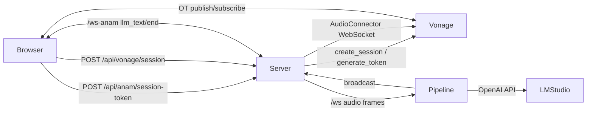

# Technology Stack

## Architecture

Browser-centric media, server-centric intelligence. The browser owns Vonage OT session (publish/subscribe) and Anam avatar rendering; the server owns session provisioning, Audio Connector WebSocket, and the Pipecat voice pipeline. Communication is split into two WebSocket planes: `/ws` (bidirectional audio with Vonage Audio Connector) and `/ws-anam` (unidirectional LLM text → browser → Anam TTS).

```
Browser (OT publisher/subscriber + Anam SDK + /ws-anam client)
   ↓↑  (VP8/H.264 + Opus over Vonage)
Vonage Video Session + Audio Connector --WebSocket--> /ws (Pipecat)
                                                    STT → LLM → TextForwarder --WebSocket--> /ws-anam
                                                                                            → Anam SDK → avatar video/audio → OT publish
```

Stateless REST for session setup, stateful WebSockets for streaming. No database, no auth layer beyond Vonage/Anam tokens. Public exposure via Cloudflare Tunnel (`start.sh:13`).

### System Components Map

| Layer | Component | File | Protocol / Contract |
|-------|-----------|------|---------------------|
| Browser UI | Shell & Controls | `static/index.html:1` | DOM, CSS grid `video-row` |
| Browser Logic | Connection Orchestrator | `static/script.js:29` `connect()` | 5-step sequence: Anam token → Vonage session → Anam init → Vonage connect → ws-anam |
| Browser Logic | Vonage Media | `static/script.js:97` `OT.initSession` + `131` `createAndPublish` | OT JS SDK, `videoSource/audioSource`, hidden div for avatar |
| Browser Logic | Anam Client | `static/script.js:67` `createClient` + `229` `handleLLMText` | `@anam-ai/js-sdk`, `streamMessageChunk/endMessage`, `interruptPersona` |
| Browser Logic | Text Bridge Client | `static/script.js:180` `WebSocket /ws-anam` | JSON `{type: llm_text|llm_end}`, `ping/pong` keepalive |
| Server | REST API | `server.py:146` + `160` + `194` + `155` | `GET /`, `GET /health`, `POST /api/anam/session-token`, `POST /api/vonage/session` |
| Server | Vonage Integration | `server.py:44` `_create_vonage_client` + `59` `_create_session_async` + `71` `_connect_audio_connector_async` | `vonage.Video` SDK, `TokenOptions`, `AudioConnectorOptions(bidirectional)` |
| Server | Audio WS Bridge | `server.py:227` `/ws` | `VonageFrameSerializer`, `FastAPIWebsocketTransport(audio_in/out)`, keepalive 10s |
| Server | Text WS Bridge | `server.py:271` `/ws-anam` | `LLMTextBridgeProcessor` fan-out, greeting `こんにちは...`, `add_client/remove_client` |
| Pipeline | Voice Pipeline | `bot.py:112` `run_bot` | `Pipeline` 7 stages, `PipelineParams(audio_in/out 16000, metrics)` |
| Pipeline | Services | `bot.py:132` STT + `145` VAD + `118` LLM | `MLXModel.LARGE_V3_TURBO_Q4` ja, `SileroVAD(0.7/0.3/0.8)`, `OpenAILLMService(LM Studio)` |
| Infra | Tunnel & Runtime | `start.sh:13`, `Dockerfile:1`, `docker-compose.yml:1` | `cloudflared tunnel`, `uvicorn :8005`, `WS_URI` derivation |

Data flow: Browser mic → OT publisher → Vonage session → Audio Connector → `/ws` → `VonageFrameSerializer` → Silero VAD → `WhisperSTTServiceMLX` → `LLMContextAggregator` → `OpenAILLMService` → `LLMTextForwarder` → `/ws-anam` → `Anam SDK streamMessageChunk` → avatar rendering + MediaStream → OT avatar publisher → Vonage session (recording) + local `anam-avatar` video.

## Core Technologies

- **Language**: Python 3.11+ (server/bot), JavaScript ES modules (browser)
- **Framework**: FastAPI (app + WebSocket) + Uvicorn (`server.py:133`, `server.py:302`)
- **Runtime**: Python `uv` (`pyproject.toml:6`, `uv.lock`), Node-less browser (ESM via `esm.sh`), Docker `python:3.13-slim` (`Dockerfile:1`)
- **Realtime Media**: Vonage Video API + Vonage Audio Connector (`server.py:22` `vonage_video`, `AudioConnectorWebSocket` bidirectional)
- **Voice Pipeline**: Pipecat-AI `>=1.4.0` (`pyproject.toml:7`) — `Pipeline`/`PipelineWorker`/`WorkerRunner` orchestration (`bot.py:10`)
- **Infra Tunnel**: Cloudflare `cloudflared tunnel --url http://localhost:8005` (`start.sh:13`)

## Key Libraries

| Area | Library | Role |
|------|---------|------|
| STT | `mlx-whisper` via `WhisperSTTServiceMLX` (`bot.py:22`, model `LARGE_V3_TURBO_Q4`) | Apple Silicon accelerated, `Language(ja)`, `no_speech_prob=0.3` |
| LLM | `pipecat.services.openai.llm.OpenAILLMService` (`bot.py:118`) | OpenAI-compatible client against `LM_STUDIO_BASE_URL` (`http://localhost:1234/v1`) |
| VAD | `silero` (`bot.py:8` `SileroVADAnalyzer`, params `confidence 0.7/start 0.3s/stop 0.8s`) | Turn detection, `audio_idle_timeout 2.0s` |
| Avatar | `@anam-ai/js-sdk` (`static/script.js:1` via `esm.sh`) | `createClient`, `SESSION_READY`/`CONNECTION_CLOSED`, `createTalkMessageStream().streamMessageChunk()` |
| Video SDK | `opentok.min.js` (`static/index.html:7`) | `OT.initSession`, `OT.initPublisher`, `session.publish/subscribe` |
| Server | `vonage>=3.3.1`, `vonage-video`, `python-dotenv`, `loguru`, `aiohttp` | Session/token generation, Anam token proxy (`server.py:168`) |

## Development Standards

### Type Safety

- Python type hints at boundaries (`bot.py:47` `AUDIO_OUT_SAMPLE_RATE: int`, `server.py:30` `_require_env(name: str) -> str`); Pipecat frames are typed (`TextFrame`, `LLMFullResponseEndFrame`).
- JS is untyped ES modules; keep browser state in explicit `let` variables (`static/script.js:11` session/publisher/client handles).

### Code Quality

- Async-first: all Vonage SDK calls wrapped in `run_in_executor` to avoid blocking event loop (`server.py:61`, `server.py:92`).
- CORS wide-open (`server.py:137` `allow_origins=["*"]`) — acceptable for demo, must be tightened for prod (add custom steering `security.md` if hardening).
- Env-driven config via `python-dotenv` `load_dotenv(override=True)` (`server.py:25`, `bot.py:32`); required vars fail fast via `_require_env` raising 500.

### Testing

- No test suite currently (`pyproject.toml` has no pytest/tox). Manual verification via `/health` (`server.py:155`) + tunnel URL connect flow (`README.md:137`). If adding tests, follow `testing.md` custom steering template.

## Development Environment

### Required Tools

- Python 3.11+ / `uv` ( `uv sync` → `.venv`), LM Studio with model loaded on `:1234`, `cloudflared` CLI, Vonage app + `private.key`, Anam API key/avatar/voice IDs.
- Apple Silicon recommended for `mlx-whisper`; falls back to CPU otherwise.

### Common Commands

```bash
# Install
uv sync

# Configure
cp .env.example .env  # then fill VONAGE_*, ANAM_*, LM_STUDIO_BASE_URL

# Run (tunnel + server)
bash start.sh          # tunnel → uv run python server.py on :8005

# Manual
cloudflared tunnel --url http://localhost:8005 &
uv run python server.py
# health check
curl http://localhost:8005/health  # → {"ok": true}

# Docker
docker compose up --build  # exposes 8005, expects WS_URI
```

### Environment Variables

`LM_STUDIO_BASE_URL`, `LM_MODEL`, `STT_LANGUAGE` (default `ja`), `VONAGE_APPLICATION_ID`, `VONAGE_PRIVATE_KEY` (path or PEM), `VONAGE_AUDIO_RATE` (default `16000`), `ANAM_API_KEY`, `ANAM_AVATAR_ID`, `ANAM_VOICE_ID`, optional `WS_URI` (override tunnel-derived `ws://host/ws`).

## Key Technical Decisions

| Decision | Choice | Rationale |
|----------|--------|-----------|
| Avatar publish path | Option A: browser `MediaStream` → Vonage `OT.initPublisher` (`static/script.js:160`) | Chosen over Experience Composer (Option B) because EC server has no GPU for WebGL avatar rendering (`README.md:160`). Enables recording of avatar stream. |
| Text bridge | Separate `/ws-anam` WebSocket + `LLMTextBridgeProcessor`/`LLMTextForwarder` (`bot.py:54`, `bot.py:96`) | Decouples LLM inference from avatar rendering; browser drives Anam TTS locally. Monkey-patched `LLMAssistantAggregator._handle_text/_handle_llm_end` to force downstream forwarding (`bot.py:35`). |
| Audio rates | Unified `16000 Hz` (`bot.py:47`, `server.py:201`, `server.py:234` `VonageFrameSerializer`) | Single rate simplifies Vonage ↔ Pipecat ↔ Whisper interop; `audio_out_10ms_chunks=2` (`server.py:244`). |
| Vonage I/O | Synchronous `vonage` SDK offloaded to thread pool (`server.py:61` `run_in_executor`) | Prevents blocking FastAPI event loop; connector lifecycle tracked in `_active_connectors` (`server.py:68`). |
| VAD tuning | Silero `confidence 0.7 / start 0.3s / stop 0.8s / min_volume 0.4` (`bot.py:146`) | Balances responsiveness vs false triggers for Japanese speech; `user_turn_stop_timeout 5.0s` avoids premature cutoff. |
| Public exposure | Cloudflare Tunnel (`start.sh:13`) instead of ngrok / direct port forward | Zero-config HTTPS/WSS URL, auto-derived `WS_URI` (`server.py:205` `wss` if not localhost). |
| No persistence | In-memory `_text_bridge` clients + `_active_connectors` only | Demo scope — no DB, no session store; restart clears state. |
| CORS | `allow_origins=["*"]` (`server.py:139`) | Demo convenience; prod must restrict and add `security.md` steering. |
| Greeting | Server-sent via `/ws-anam` on connect (`server.py:284`) | Ensures avatar speaks first even before STT; alternative is LLM-generated. |

## Module Boundaries & Dependencies

* **Frontend depends on**: Vonage Video Cloud (session/token), Anam Cloud (avatar render), Server REST (`/api/*`) and WS (`/ws-anam`). No direct DB.
* **Server depends on**: Vonage Video API, Anam Token API (`https://api.anam.ai/v1/auth/session-token`), LM Studio (`http://localhost:1234/v1`), Pipecat serializers/transports.
* **Pipeline depends on**: `transport` (injected by server), `text_bridge` singleton (`bot.py:89` `_text_bridge`), env `VONAGE_AUDIO_RATE`/`LM_MODEL`/`STT_LANGUAGE`.
* **Infra depends on**: `.env` + `private.key` (or PEM string), `cloudflared` binary, Docker host.



---
_Document standards and patterns, not every dependency_
